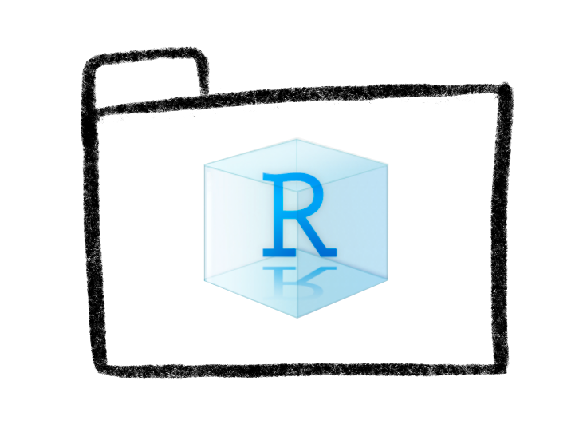
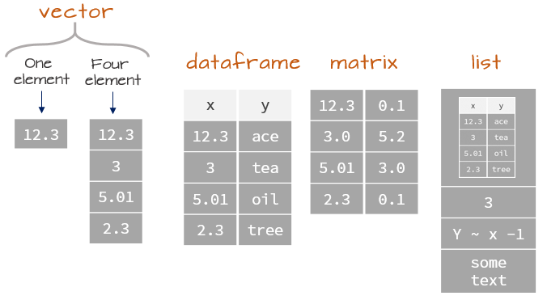

layout: true
class: animated, fadeIn

---
class: inverse, left, middle

# _R Básico: comenzando un viaje 🚀_


Martín Venegas Márquez


***
[Doctorado en Psicología UDP - Seminario Metodológico Disciplinario: Metodologías Cuantitativas - Otoño 2025]()

<br>

#### Mayo, 2025

---
class: inverse, left, middle

# Contenidos de la sesión

--

**1. ¿Por qué utilizar R?**

--

**2. ¿Qué es R? ¿Qué es RStudio?**

--

**3. Fundamentales de R**

---
class: middle, center, inverse

# _1. ¿Por qué utilizar R?_

---

# 🎯Razón estrategica: demanda profesional y académica 

--

- Muchas organizaciones, universidades, ONGs, consultoras e institutos públicos **buscan investigadores que manejen R**.

--

- Tener dominio de R:

  * **Abre puertas** en investigación, análisis de datos, políticas públicas, consultoría, etc.

  * Mejora la empleabilidad, ya que el **análisis de datos es una habilidad transversal** a muchos campos y disciplinas.

--

- Además, **R es gratuito** y no depende de licencias caras, lo que facilita su uso profesional sin costo extra.

---
# 🎯Razón estrategica: demanda profesional y académica 

--

- Cada vez más artículos científicos, especialmente en ciencias sociales, publican sus análisis hechos en R.

--

- **Revistas de alto impacto exigen códigos reproducibles para aceptar publicaciones**.

  * 🤓Por ejemplo, desde 2021 _[Nature](https://www.nature.com/nature-portfolio/editorial-policies/reporting-standards)_ exige que los autores proporcionen datos y código para la revisión de los pares y la publicación, siempre que sea posible.

--

- Aprender R permite estar alineado con las mejores prácticas de la ciencia actual.

---

# 🔧 Razón técnica: potencia y flexibilidad

--

- R es una herramienta poderosa y flexible que permite manejar datos complejos, crear gráficos personalizados y automatizar análisis.

--

- Entre otras cosas, podemos:

  ✅Emplear múltiples técnicas estadísticas de manera relativamente sencilla

  ✅ Crear nuestras propias funciones.

  ✅ Automatizar reportes.

  ✅ Diseñar gráficos personalizados.

--

- No está limitado a las **opciones de un menú**.

---
# R v/s Stata, SPSS, etc...

.left-column[

.center[]

🔢**R es un lenguaje de programación:**

Escribes código para decirle al  
computador qué hacer.

]
.right-column[

.center[] .center[]

**👉 SPSS y Stata son principalmente programas de menú:**

Haces clics en botones o menús para ejecutar comandos (aunque Stata también permite escribir algo de código, pero más restringido).


]

---

 _**Veamos...**_ 🤓🔎

| Aspecto                       | R                                                              | SPSS / Stata                                                   |
|--------------------------------|----------------------------------------------------------------|----------------------------------------------------------------|
| **Forma principal de trabajar**💻   | Escribes código                                                | Usas menús y formularios                                       |
| **Flexibilidad**🧶                  | Muy alta: puedes crear funciones, automatizar procesos, personalizar todo | Limitada a las opciones que ofrece el programa                 |
| **Reproducibilidad** 🎬             | Muy alta: guardas todo el código, puedes replicarlo exactamente | Baja si solo usas menús (a menos que guardes sintaxis aparte)   |
| **Costo**💲                         | Gratis y de código abierto                                     | Licencias pagadas (caras en general)                           |
| **Extensión**📏                     | Miles de paquetes creados por la comunidad                     | Limitado a lo que la empresa desarrolla                        |
| **Curva de aprendizaje** 📈         | Más empinada al principio (hay que aprender a codificar)       | Más fácil al principio (solo haces clics)                      |

---

# 👌 Razón ética: reproducibilidad en la ciencia

--

- La crisis de reproducibilidad mostró que muchos resultados científicos no se pueden replicar porque:

  * No se documentaron bien los análisis.

  * Se hicieron manualmente y no quedaron registros exactos.

--

- En R, todo lo que haces queda escrito en código: cada paso, cada decisión, cada transformación de datos. **Tenemos la _receta_ de cómo llegar al resultado** 📝➡🍲

---

# 👌 Razón ética: reproducibilidad en la ciencia

--

- Eso permite:

  ✅ Auditar los análisis (ver cómo se llegó a un resultado).

  ✅ Replicar los análisis con nuevos datos.

  ✅ Corregir errores de manera transparente.

--

🤓**Nota:** existe un movimiento de ciencia abierta que fomenta el uso de herramientas como R para avanzar hacia una ciencia más reproducible, transparente y replicable. Ver recursos como el [Center for Open Science](https://www.cos.io/) o en Chile el [Laboratorio de Investigación Social Abierta (LISA)](https://lisa-coes.netlify.app/)
---
class: middle, center, inverse

# _1. ¿Qué es R? ¿Qué es RStudio?_

---
# ¿Qué es R?

Según [r-project.org](https://www.r-project.org/about.html): 

--

> R is a **language** and **environment** for statistical computing and graphics (...) 🤓

--

> R provides a wide **variety of statistical** (linear and nonlinear modelling, classical statistical tests, time-series analysis, classification, clustering, …) and **graphical techniques**, and is highly **extensible** (...) 💻📊

--

> The term “environment” is intended to characterize it as a **fully planned and coherent system**, rather than an incremental accretion of very specific and inflexible tools, as is frequently the case with other data analysis software (...) 🧐

--

> Many users think of R as a statistics system. **We prefer to think of it as an environment within which statistical techniques are implemented**. R can be extended (easily) via packages (...) 💡

---
class: middle, center, inverse

# Entonces... ¿qué es R?

.large[💡[**Un lenguaje y un ambiente (sistema planificado y coherente) de programación por el cuál se pueden implementar herramientas gráficas y estadísticas.**]()]

---
# 📌 Principales características de R

**1. Lenguaje especializado en análisis de datos y estadística** 📊

--

- R fue creado específicamente para análisis estadístico, modelamiento y visualización de datos.

--

- Tiene muchas funciones estadísticas de base (regresión, pruebas de hipótesis, análisis multivariado, etc.).

--

| Regresión lineal en ecuación                         | Regresión lineal en R                                 |
|------------------------------------------|--------------------------------------------------------|
| $\hat{Y} = \beta_0 + \beta_1 X$          | `lm(vary ~ varx, data = df)`               |

📝**Nota:** `varx` y `vary` corresponden a columnas del set de datos `df`

---
# 📌 Principales características de R

**2. Orientado a objetos** 📍

--

- En R, todo es un objeto (vectores, tablas, modelos, gráficos, etc.).

--

- Se trabaja construyendo, modificando y combinando objetos.

--

- Esto da mayor flexibilidad al trabajo, permitiendo la implementación de soluciones creativas y buenas prácticas.

--

> 🤓 **Nota técnica:** R es un lenguaje orientado a objetos (OOP, _Object-Oriented Programming_). Esto significa que los datos y funciones pueden agruparse en objetos, y estos pueden tener clases, atributos y métodos específicos que definen cómo deben comportarse. Los tres tipos más comunes son: S3, S4 y R6 (ver más [aquí](https://adv-r.hadley.nz/oo.html)).

---
# 📌 Principales características de R

**3. Lenguaje interpretado**🔢

--

- A diferencia de otros lenguajes, no es necesario "compilar" el código. **R ejecuta directamente las instrucciones dadas, línea por línea.**

--

- Esto facilita el trabajo exploratorio y el análisis interactivo.

---
# 📌 Principales características de R

**4. Extensibilidad mediante paquetes**📦

--

- Existen más de 20.000 paquetes en [CRAN](https://cran.r-project.org/) (y muchos más en [GitHub](https://github.com/)) que amplían las capacidades de R: desde modelos avanzados hasta visualizaciones interactivas, _Machine Learning_, _web scraping_, etc.

--

- Es posible crear paquetes propios.

--

- Ejemplo de paquetes creados en Chile y archivados en CRAN: 

✅ [_calidad_](https://cran.r-project.org/web/packages/calidad/index.html): evaluar la calidad de estimaciones en base a metodología del INE  
✅[ _chilemapas_](https://cran.r-project.org/web/packages/chilemapas/index.html): mapas terrestres con tipologías simplificadas  
✅ [_guaguas_:](https://cran.r-project.org/web/packages/guaguas/index.html) datos de nombres inscritos en Chile entre 1920 y 2021

---

.center[]

---
# 📌 Principales características de R

**5. Gráficos y visualizaciones de alta calidad**📊

--

- R tiene sistemas de visualización muy potentes, como:

✅ Base R graphics

✅ ggplot2 (del ecosistema tidyverse)

✅ librerías para gráficos interactivos como plotly, highcharter, leaflet, etc.

--

- Además, tiene recursos que facilitan su aprendizaje (ej. [R Graph Gallery](https://r-graph-gallery.com/#))

--

> 🤓 **Nota:** Algunos recursos que serán de utilidad más adelante: [tutorial de ggplot2](https://www.cedricscherer.com/2019/08/05/a-ggplot2-tutorial-for-beautiful-plotting-in-r/) y [Data Visualization: A practical introduction](https://socviz.co/)
---

## Base R graphics

.pull-left[
```{r eval=FALSE}
# Gráfico de dispersión en R base
plot(mtcars$wt, mtcars$mpg,
     main = "Consumo vs Peso (R base)",
     xlab = "Peso del auto (wt)",
     ylab = "Millas por galón (mpg)",
     pch = 19,         # tipo de punto
     col = "blue")     # color

```
]

.pull-right[
```{r echo=FALSE}
# Gráfico de dispersión en R base
plot(mtcars$wt, mtcars$mpg,
     main = "Consumo vs Peso (R base)",
     xlab = "Peso del auto (wt)",
     ylab = "Millas por galón (mpg)",
     pch = 19,         # tipo de punto
     col = "blue")     # color

```
]


---

## Ggplot2

.pull-left[
```{r eval=FALSE}
# Primero cargar el paquete
library(ggplot2)

# Gráfico de dispersión con ggplot2
ggplot(mtcars, aes(x = wt, y = mpg)) +
  geom_point(color = "darkred", size = 3) +
  labs(title = "Consumo vs Peso (ggplot2)",
       x = "Peso del auto (wt)",
       y = "Millas por galón (mpg)") +
  theme_minimal()
```
]

.pull-right[
```{r echo=FALSE}
# Primero cargar el paquete
library(ggplot2)

# Gráfico de dispersión con ggplot2
ggplot(mtcars, aes(x = wt, y = mpg)) +
  geom_point(color = "darkred", size = 3) +
  labs(title = "Consumo vs Peso (ggplot2)",
       x = "Peso del auto (wt)",
       y = "Millas por galón (mpg)") +
  theme_minimal()
```
]

---

## Plotly

.pull-left[
```{r echo=FALSE, message=FALSE, warning=FALSE}
# Cargar plotly
library(plotly)

# Crear gráfico interactivo
plot_ly(data = mtcars, x = ~wt, y = ~mpg, type = 'scatter', mode = 'markers',
        marker = list(color = 'forestgreen', size = 10)) %>%
  layout(title = "Consumo vs Peso (plotly)",
         xaxis = list(title = "Peso del auto (wt)"),
         yaxis = list(title = "Millas por galón (mpg)"))
```
]

.pull-right[
```{r eval = FALSE}
# Cargar plotly
library(plotly)

# Crear gráfico interactivo
plot_ly(data = mtcars, x = ~wt, y = ~mpg, type = 'scatter', mode = 'markers',
        marker = list(color = 'forestgreen', size = 10)) %>%
  layout(title = "Consumo vs Peso (plotly)",
         xaxis = list(title = "Peso del auto (wt)"),
         yaxis = list(title = "Millas por galón (mpg)"))
```
]


---
# 📌 Principales características de R

**6. Código abierto y gratuito**👩‍💻

--

- R es software libre bajo licencia GNU.

--

- No es necesario pagar licencias ni estar atado a ninguna empresa.

--

- Esto permite revisar, modificar y compartir el código fuente si asi se desea.

---
# 📌 Principales características de R

**7. Fuerte comunidad de usuarios**👥👥👤

--

- Hay una **comunidad activa de usuarios** que crean paquetes, tutoriales, libros, cursos gratuitos y responden dudas en foros.

--

- Esto **facilita el aprendizaje** y la resolución de problemas.

--

- Los principales recursos de consulta son:

1. **[Stackoverflow](https://stackoverflow.com/questions):** foro sobre código en general
2. **[Posit Community](https://forum.posit.co/):** dudas más especificas de R
3. **[CRAN](https://cran.r-project.org/):** archivo de R, consulta sobre paquetes y documentación


.pull-left[]
.pull-right[]

---
# 📌 Principales características de R

**8. Ideal para ciencia reproducible**🔄

--

- Como todo se hace escribiendo código, es posible guardar exactamente todos los pasos de nuestro análisis.

--

- Facilita prácticas de transparencia, replicación y publicación reproducible.

---
# RStudio

--

- Es una **interfaz gráfica (IDE)** para trabajar con R de forma más amigable.

--

- No reemplaza a R: **lo usa por debajo**.

--

- Mejora la experiencia al programar en R gracias a:

  * Coloreado de sintaxis
  * Panel de scripts, consola, entorno y archivos
  * Integración con proyectos, paquetes y versiones de control
  
--

💡 **Piensen en R como el motor, y RStudio como el tablero de control.**

---
# RStudio


---
# R vs. RStudio

| Característica     | R                        | RStudio                            |
|--------------------|--------------------------|------------------------------------|
| ¿Qué es?           | Lenguaje de programación | Interfaz para usar R               |
| ¿Cómo se usa?      | Consola o scripts        | IDE con múltiples herramientas     |
| ¿Requiere el otro? | No                       | ✅ Sí, necesita tener R instalado   |
| ¿Para qué sirve?   | Hacer cálculos, análisis | Facilitar el trabajo con R         |

---

class: middle, center, inverse

# _3. Fundamentales de R_

---
# RScript

--

- Archivo tipo `.R` que alberga el código necesario para la realización de una tarea o una serie de tareas (ej. procesamiento, análisis o visualización de datos, entre otros)

--

- Permiten guardar y compartir nuestro trabajo 💾

--

- Serán nuestra principal herramienta de trabajo 🧐

--

## ✨**Siempre escribir nuestro código en el script, nunca en la terminal/consola**✨

---
# RScript
## Los Scripts como recetas de cocina 👨‍🍳

--

- Son un **registro** de pasos necesarios para llegar a un plato especifico

--

- Los pasos deben ser realizados en **orden**: _no podemos cocer verduras si no hemos hervido el agua_

--

- Plantean el uso de **herramientas** para lograr un plato: _para hervir agua necesitamos una olla o un hervidor_

--

- Las herramientas tienen **funciones definidas**: _no podemos hervir agua con un tenedor o un microondas (o no sería lo más eficiente)_

---
# RScript
## Mayor reproducibilidad y transparencia 🔄

--

- Así como nosotros usamos nuestra receta de cocina para llegar al plato final, **otros pueden hacer lo mismo**. De la misma manera, nosotros podemos usar otras recetas para hacer otros platos (u otra versión del de nosotros) 📝👩‍🍳

--

- Y más importante aun, nuestro trabajo está a disposición del ojo crítico de los demás (y viceversa)... **¡dos (o muchas) cabezas piensan mejor que una!**👥

---
# Working Directory 📁🔨

--

- La primera vez que abrimos R, este se "posiciona" en una carpeta del computador. Esta será nuestra carpeta de trabajo o... **_Working Directory_**

--

- El _Working Directory_ se puede revisar con el comando `getwd()`

--

- Así también, se puede cambiar con `setwd("ruta-a-carpeta-de-trabajo")`

--

- La carpeta de trabajo debe ser fijada al principio del script

--

- La idea es que el _Working Dirctory_ incluya todos los insumos necesarios para la realización de la tarea o las tareas que se realizarán en el script (ej. set de datos)

---
# Rproject
.left-column[

]

--

- Es una forma que tiene R para **organizar** la carpeta de trabajo

--

- Funciona a través de un archivo `.Rproj`, el cual define la **carpeta raíz** 🌱

--

- La carpeta raíz se entiende como la carpeta general que **alberga el proyecto** (y todos sus insumos y resultados). 

--

- **Facilita la reproducibilidad**. Podemos compartir nuestro trabajo sin necesidad de modificar el código (cambiar  el directorio de trabajo `setwd()`)

--

👉**En términos concretos, la carpeta en dónde esté el `.Rproj` será automáticamente el _Working Directory_**

---
# Rproject
## Uso de rutas relativas

--

- Al explicitar una carpeta raíz, no es necesario especificar la ruta completa al archivo. 

--

- Por ejemplo, si queremos cargar un set de datos `datos.rds` que está en la misma carpeta que el `.Rproj` podemos:

--

```r
readRDS("datos.rds")
```

--

En vez de...

--

```r
readRDS("C:/Users/mvenegasm/Desktop/ayudantia/datos.rds")
```

📝**Nota:** En este ejemplo, la carpeta `ayudantia` sería: (1) donde se encuentra el `.Rproj` (2) la carpeta raíz y (3) el _Working Directory_.

---
# Paquetes (_packages_) 📦

--

- **Conjunto de funciones** para un tipo de tarea 🧐

--

- Una de las principales potencialidades de R es su capacidad de **extensibilidad**

--

- La extensibilidad implica que se pueden ampliar las funciones propias de R en base a las necesidades específicas de los usuarios

--

- Los usuarios pueden crear sus propios paquetes en la medida que lo consideren necesario.

--

- Existen una serie de paquetes que presentan **alternativas más idóneas** para tareas cotidianas, en comparación a las funcionalidades de R base.

--

- Los paquetes suelen tener una comunidad detrás que está preocupada de darles soporte, resolver _bugs_ y responder dudas

---

# Paquetes (_packages_) 📦

## Los paquetes como utensilios de cocina 🔪

--

- Los paquetes se pueden pensar como los utensilios que se utilizan para ejecutar las recetas

--

- Los utensilios deben ser acordes a lo que solicita la receta

---
# Paquetes (_packages_) 📦

## Instalación de paquetes 📦🔨

--

- La instalación de paquetes se debe hacer solamente una vez

--

- Una vez instalado el paquete, este estará albergado en nuestro computador

--

- Es necesario actualizar los paquetes de R cada cierto tiempo. Si se actualiza la versión de R, se deben volver a instalar los paquetes.

--

- La instalación se hace con...

--

```r
install.packages("nombre-paquete")
```
---
# Paquetes (_packages_) 📦

## Carga de paquetes 📦⬇

--

- Instalar un paquete no significa que esté listo para ser usado, para ello se deben "cargar"

--

- Siguiendo la analogía de la cocina, sería como sacar los utensilios de la alacena para dejarlos en la mesa de cocina 👉🔪👨‍🍳

--

- Los paquetes se cargan con...

```r
library(nombre-paquete)
```

---
# Paquetes (_packages_) 📦
## `pacman` (_package manager_)

--

- Un paquete para manejar paquetes

--

- Una recomendación para hacer el código más eficiente

--

- `p_load()` instala y carga los paquetes según sea necesario
---
# Paquetes (_packages_) 📦
## `pacman` (_package manager_)

--

En vez de...

--

```r
install.packages("dplyr")
install.packages("ggplot2")
install.packages("haven")
library("dplyr")
library("ggplot2")
library("haven")
```

--

Usar...

--

```r
install.packages("pacman")
pacman::p_load(dplyr, ggplot2, haven)
```

---
# Carga de datos 💻⬇

--

- R permite la **carga y salida de múltiples tipos de archivos** (.xlsx, .csv, .dta, etc.)

--

- Esto hace más **flexible** el uso de insumos de distintos programas

--

- A modo de buena práctica, es recomendable que toda la carga de datos o insumos se realice al **inicio del script**

--

- En general, es recomendable trabajar con archivos `.RDS`. Suelen ser más livianos que otras opciones (p.ej el `.dta` de Stata)

---
# Carga de datos 💻⬇

| Tipo de archivo | Extensión  | Paquete       | Función para cargar                         |
|-----------------|------------|---------------|---------------------------------------------|
| Excel           | `.xlsx`    | `readxl`      | `read_excel("archivo.xlsx")`               |
| CSV             | `.csv`     | `readr`       | `read_csv("archivo.csv")`                  |
| Stata           | `.dta`     | `haven`       | `read_dta("archivo.dta")`                  |
| SPSS            | `.sav`     | `haven`       | `read_sav("archivo.sav")`                  |
| RDS             | `.rds`     | base de R     | `readRDS("archivo.rds")`                   |
| RData           | `.RData`   | base de R     | `load("archivo.RData")`                    |
| Feather         | `.feather` | `arrow`       | `read_feather("archivo.feather")`          |

🤓**Nota:** RDS son el formato para archivos únicos. RData son el formato para un ambiente de trabajo en R. Feather son archivos livianos, más eficientes y multiplataforma, especialmente útiles cuando se trabaja con R y Python.

---
# Carga de datos 💻⬇
## Ejemplos

```r
# Excel
pacman::p_load(readxl) # Instalar y/o cargar paquete leer .xlsx
datos <- read_excel("encuesta.xlsx") # Cargar datos
```

```r
# Stata
pacman::p_load(haven) # Instalar y/o cargar paquete leer .dta
datos <- read_dta("encuesta.dta") # Cargar datos
```

```r
# R
datos <- readRDS("encuesta.rds") # Cargar datos
```
---
# Tipos de datos 🔢🔡

--

- El tipo de datos se entiende como la clasificación que un valor puede tener en R y que tipo de operaciones se pueden hacer con cada uno

--

- Existen al menos 6 tipos de tipos de datos: `numeric`, `integer`, `logical`, `character`, `factor` y `complex`

--

- Casi cada tipo de dato en R tiene su relación con el nivel de medición de las variables
---
# Tipos de datos 🔢🔡
## `numeric`

- Valores dentro de los números reales. **Incluyen decimales**

```r
horas <- c(1, 0.5, 2, 1.75, 0.25, 4)
class(horas)
```

- Se relacionan directamente con las variables continuas, ya que se componen de números decimales y enteros.

👀**OJO**: Si bien este tipo de dato está pensado para variables continuas, en la práctica suele usarse también para variables empíricamente discretas (ej. edad).

---
# Tipos de datos 🔢🔡
## `integer`

- Valores dentro de los números enteros

- Se declaran posponiendo una `L` al final de cada número o la secuencia

```r
folio <- c(1:10L)
class(folio)
```

- Se relacionan con variables discretas, en tanto no admiten números decimales

---
# Tipos de datos 🔢🔡
## `logical`

- Valores booleanos/lógicos de verdadero o falso

```r
prueba <- c(TRUE, FALSE, FALSE, TRUE, TRUE)
class(prueba)
```

- No están directamente relacionados a un tipo de nivel de medición, pero si suelen ser los resultados de pruebas o recodificaciones a partir de operadores relacionales

---
# Tipos de datos 🔢🔡
## `character`

- Valores de texto

```r
sexo <- c("Hombre", "Mujer", "Mujer", "Hombre", "Mujer")
class(sexo)
```

- Se relacionan directamente con el nivel de medición nominal y ordinal

---
# Tipos de datos 🔢🔡s
## `factor`

- Valores de texto asociados a un número limitado de categorías (`levels`)

- Son útiles cuando se quiere establecer un orden distinto al alfabético

- Tienen ciertas ventajas en el trabajo con R (p.ej. predictores categóricos en modelos)

```r
sexo_factor <- factor(c("Hombre", "Mujer", "Mujer", "Hombre", "Mujer"))
class(sexo_factor)
```

- También se relacionan directamente con el nivel de medición nominal y ordinal

---
# Tipos de datos 🔢🔡
## `complex`

- Valores complejos que incluyen números reales e imaginarios

```r
numero_complejo <- c(2+3i, 2i, 1-1i)
class(numero_complejo)
```

- No están directamente relacionados a un nivel de medición

---
# Tipos de datos 🔢🔡
## Aplicando transformaciones

Si bien cada tipo de dato tiene su propia clase, es posible transformarlos:

```r
as.numeric() # Pasar a númerico
as.integer() # Pasar a entero
as.logical() # Pasar a lógico
as.character() # Pasar a texto
as.factor() # Pasar a factor
as.complex() # Pasar a número complejo
```
---
# Tipos de datos 🔢🔡
## Síntesis

| Tipo     | Ejemplo                | Descripción |
|----------|------------------------|-------------|
| numeric | `2`, `3.14`            | Números reales, con decimales |
| integer   | `4L`                   | Números enteros (terminan en `L`) |
| logical   | `TRUE`, `FALSE`        | Valores booleanos (sí o no, verdadero o falso) |
| character    | `"hola"`              | Cadenas de caracteres |
| factor   | `factor(c("H", "M"))` | Variables categóricas, usadas comúnmente para factores o niveles |
| complex   | `2+3i`, `1-1i`           | Números complejos con partes reales e imaginarias |

---
# Estructuras de datos 🧱

.left-column[

]

.right-column[
- Una estructura de datos es una **forma organizada de almacenar y manipular colecciones de valores**. 

- Cada estructura tiene reglas sobre cómo se almacenan los datos y **qué tipos de operaciones se pueden aplicar sobre ellos**. 

- Estas estructuras son **fundamentales para el análisis estadístico**, ya que determinan cómo accedemos, transformamos y analizamos la información.
]

---

# Estructuras de datos 🧱

| Estructura   | Descripción                                                                 | Ejemplo                                  |
|--------------|------------------------------------------------------------------------------|------------------------------------------|
| **vector**   | Secuencia de elementos del mismo tipo                                       | `c(1, 2, 3)`                              |
| **data.frame** | Tabla bidimensional con columnas de distintos tipos                        | `data.frame(nombre = c("Ana", "Luis"), edad = c(25, 30))` |
| **list**     | Colección de objetos de tipos distintos                                      | `list(nombre = "Ana", edad = 30, notas = c(6, 7, 5))` |
| **matrix**   | Arreglo bidimensional con elementos del mismo tipo                          | `matrix(1:6, nrow = 2)`                   |
| **array**    | Arreglo multidimensional (más de 2 dimensiones), todos del mismo tipo        | `array(1:12, dim = c(2, 2, 3))`           |

---
# Estructuras de datos 🧱


---
# Operadores 🔣

--

- Símbolos que no son de uso exclusivo en R, sino que vienen de la matemática o la lógica (ej. la suma)

--

- Ahora bien, no todos tienen el mismo significado que en otros softwares.

--

- Tendrán distintos objetivos: relacionar, condicionar, excluir, repetir etc. Lo importante: **buscan darle un sentido a la "orden" que le estamos dando a R.**

--

- Los utilizaremos cuando filtremos nuestros datos para personas de ciertas categorías, cuando calculemos variables nuevas (de manera aritmética o condicional) o, simplemente, cuando queramos hacer procesos "concatenados".

---
# Operadores 🔣
## ¿Y de qué me sirven en la práctica?

--

- Pensemos en la siguiente situación, tenemos las edades de cinco personas: Juan 👨‍🦱, Matías 🧔, Ana 👩‍🦰, Leonor 🧓 y Sebastián 🧑

--

```{r}
# Creemos un objeto por persona
juan <- 24
matias <- 35
ana <- 45
leonor <- 65
sebastian <- 12

```

--

- Los operadores nos podrían servir para responder algunas preguntas respecto a las edades de estas personas 😯. Vamos viendo...

---
## Operadores aritméticos ➕➖

Realizan operaciones matemáticas básicas:

```r
3 + 2   # Suma
3 - 2   # Resta
3 * 2   # Multiplicación
3 / 2   # División
3 ^ 2   # Potencia
```
---
## Operadores aritméticos ➕➖

--

¿Cuál es la diferencia de edad entre Leonor 🧓 y Matías 🧔?

```{r}
leonor - matias
```
--

¿Cuánto es el doble de la edad de Juan 👨‍🦱?

```{r}
juan*2
```
--

¿Cuál es la suma de todas las edades 👨‍🦱🧔👩‍🦰🧓🧑?

```{r}
juan + matias + ana + leonor + sebastian
```
---
## Operadores relacionales 💡
Comparan valores y devuelven `TRUE` o `FALSE`:

```r
3 == 3   # Igualdad (TRUE)
3 != 2   # Diferente (TRUE)
3 > 2    # Mayor que (TRUE)
3 <= 2   # Menor o igual (FALSE)
```
---
## Operadores relacionales 💡

--

¿Es la edad de Matías 🧔 igual a la de Sebastián 🧑?

```{r}
matias == sebastian
```

--

¿La edad de Ana 👩‍🦰 es distinta de 45?

```{r}
ana != 45
```
--

¿La edad de Juan👨‍🦱 es menor a la de Matías 🧔?

```{r}
juan < matias
```
---
## Operadores lógicos ✔✖

Usan operadores booleanos:

```r
TRUE & FALSE   # Y lógico (FALSE)
TRUE | FALSE   # O lógico (TRUE)
!TRUE          # Negación (FALSE)
```
---
## Operadores lógicos ✔✖

--

¿La edad de Ana 👩‍🦰 y la edad de Juan 👨‍🦱 es mayor a 30?

```{r}
ana > 30 & juan > 30 # No, porque no se cumplen ambas condiciones
```
--

¿La edad de Ana 👩‍🦰 o la edad de Juan 👨‍🦱 es mayor a 30?

```{r}
ana > 30 | juan > 30 # Sí, se cumple al menos una condición
```
--

¿La edad de Leonor 🧓 no es 65?

```{r}
!(leonor == 65) # No, porque si tiene 65 años 
```

---
## Operador de pertenencia ⏭

Verifican si un elemento pertenece a un conjunto:

```r
2 %in% c(1, 2, 3)  # TRUE
```

---
## Operador de pertenencia ⏭

--

¿Alguna de las personas tiene 33 años?

```{r}
33 %in% c(juan, matias, ana, leonor, sebastian)
```
--

¿Alguna de las personas tiene 12 años?

```{r}
12 %in% c(juan, matias, ana, leonor, sebastian)
```
---
# Operadores 🔣
## En la realidad...

--

- En la vida real probablemente estaremos trabajando con set de datos, donde las filas corresponden a unidades de información (ej. individuos) y las columnas corresponden a características de esas unidades (ej. variables)

--

- Recordando las estructuras de datos, estaremos trabajando con un `data.frame`

--

- La pregunta es **¿cómo aplicamos estos operadores a un set de datos?** 🤔 Veamos...

---
# Operadores 🔣
## En la realidad...

--

Creemos un set de datos:

```{r}
datos <- data.frame(
  persona = c("Juan", "Matias", "Ana", "Leonor", "Sebastian"),
  edad = c(24, 35, 45, 65, 12)
)
```

--

Accedemos a la información de las columnas con `$`

```{r}
datos$persona
```
---
# Operadores 🔣
## En la realidad...

--

Podemos obtener la información de una columna y una fila en particular, al hacer un _subset_ en base a un **filtro**.

```{r}
datos$edad[datos$persona == "Juan"]
```
--

Aqui le estamos diciendo a R algo como: 

--

> _De la columna `edad` del objeto `datos`, entregame los valores de las filas que sean idénticas al texto "Juan"_

--

👀**OJO:** Para hacer el filtro, estamos usando el operador relacional `==`

---

# Operadores 🔣
## En la realidad...

--

Con esta información, ya podríamos hacer las mismas pruebas que antes, por ejemplo...

--

¿Cuál es la diferencia de edad entre Leonor 🧓 y Matías 🧔?

```{r}
datos$edad[datos$persona == "Leonor"] - datos$edad[datos$persona == "Matias"] 
```

--

¿La edad de Juan👨‍🦱 es menor a la de Matías 🧔?

```{r}
datos$edad[datos$persona == "Juan"] < datos$edad[datos$persona == "Matias"] 
```

---
# Operadores 🔣
## En la realidad...

--

¿Y si queremos crear una nueva variable que indique quienes tienen más de 60 años?🤔

--

```{r}
datos$mayor60 <- datos$edad > 60 # Crear columna
datos$mayor60 # Ver resultados
```

💡**Tip**: Puedes ver el set de datos con `View(datos)`

---
# Operadores 🔣
## En la realidad...

--

Otras funciones útiles...

--

¿Quién es la persona de más edad? 🧓

```{r}
datos$persona[which.max(datos$edad)]
```

--

¿Quién es la persona de menos edad? 🧑

```{r}
datos$persona[which.min(datos$edad)]
```
---

class: middle, center, inverse

# _Ejercicios_

---
# Ejercicios

--

1. Abrir RStudio. Obtener el _Working Directory_ con `getwd()`. Luego cambiar el _Working Directory_ con `setwd()`.

--

2. Abrir RStudio. Crear un nuevo `.Rproj` con el nombre `ayudantia1`.

--

2. Instalar y cargar el paquete `readxl` a través del paquete `pacman`

--

3. Cargar set de datos `encuesta.xlsx` como `encuesta`

--

4. Investigar tipos de datos de las columnas con `class()`

--

**Ahora... apliquemos los operadores a las columnas 😎**

```{r eval = FALSE, include = FALSE}
# Base de datos hipotética
encuesta <- data.frame(
  persona = c("Juan", "Matias", "Ana", "Leonor", "Sebastian"),
  edad = c(24, 35, 45, 65, 12),
  ingreso = c(800, 1500, 2000, 1000, 500),
  estudia = c(TRUE, FALSE, FALSE, FALSE, TRUE)
)

writexl::write_xlsx(encuesta, "output/encuesta.xlsx")
```

---

# 5. Aplicando operadores
## Preguntas con operadores simples

(a) ¿Qué personas tienen ingresos mayores a 1000?

```{r include = FALSE, eval = FALSE}
encuesta$persona[encuesta$ingreso > 1000]
```

(b) ¿Quiénes estudian y tienen menos de 30 años?

```{r include = FALSE, eval = FALSE}
encuesta$persona[encuesta$estudia & encuesta$edad < 30]
```

(c) ¿Qué edad tiene la persona con mayor ingreso?

```{r include = FALSE, eval = FALSE}
encuesta$edad[which.max(encuesta$ingreso)]
```

(d) ¿Alguna persona tiene exactamente 500 de ingreso?
```{r include = FALSE, eval = FALSE}
500 %in% encuesta$ingreso
```

---
# 5. Aplicando operadores
## Agregamos una nueva variable

(e) Crear una nueva variable que indique si la persona es mayor de edad:

```{r include = FALSE, eval = FALSE}
encuesta$mayor_edad <- encuesta$edad >= 18
```

(f) ¿Qué personas **no estudian** y tienen ingresos **mayores a 1000**?

```{r include = FALSE, eval = FALSE}
encuesta$persona[!encuesta$estudia & encuesta$ingreso > 1000]
```

---
# 5. Aplicando operadores
## Preguntas más complejas 🧠

(g) ¿Quiénes **estudian** o tienen **menos de 500 de ingreso**?

```{r include = FALSE, eval = FALSE}
encuesta$persona[encuesta$estudia | encuesta$ingreso < 500]
```

(h) ¿Qué personas tienen **entre 30 y 60 años** y **no estudian**?

```{r include = FALSE, eval = FALSE}
encuesta$persona[encuesta$edad >= 30 & encuesta$edad <= 60 & !encuesta$estudia]
```

(i) ¿La persona con menor ingreso es menor de edad?

```{r include = FALSE, eval = FALSE}
encuesta$edad[which.min(encuesta$ingreso)] < 18
```

(j) ¿Qué personas tienen ingresos distintos de 1000 y son mayores de 40 años?

```{r include = FALSE, eval = FALSE}
encuesta$persona[encuesta$ingreso != 1000 & encuesta$edad > 40]
```

---

## ¡A practicar!🎉

- Pueden modificar los valores y probar nuevas condiciones.

- Recuerden que puedes combinar operadores para hacer filtros más complejos.

- Pueden usar `View(datos)` o `print(datos)` para observar la base mientras trabajas.

---

class: middle, center, inverse

# ¡Muchas gracias!

