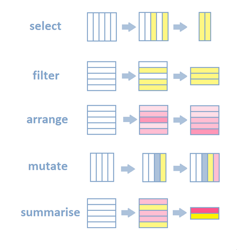

layout: true
class: animated, fadeIn

---
class: inverse, left, middle

# _Manipulación de datos en R 🔢🔨🔧_


Martín Venegas Márquez


***
[Doctorado en Psicología UDP - Seminario Metodológico Disciplinario: Metodologías Cuantitativas - Otoño 2025]()

<br>

#### Mayo, 2025

---

---

---
class: inverse, left, middle

# Contenidos de la sesión

--

**0. Recordando...**

--

**1. Manejo básico con R Base**

--

**2. Manejo básico de Tidyverse**

--

**3. Manos a la obra**

```{r include=FALSE}
pacman::p_load(tidyverse)
```


---

class: middle, center, inverse

# _0. Recordando..._

---
# Tipos de datos 🔢🔡

| Tipo     | Ejemplo                | Descripción |
|----------|------------------------|-------------|
| numeric | `2`, `3.14`            | Números reales, con decimales |
| integer   | `4L`                   | Números enteros (terminan en `L`) |
| logical   | `TRUE`, `FALSE`        | Valores booleanos (sí o no, verdadero o falso) |
| character    | `"hola"`              | Cadenas de caracteres |
| factor   | `factor(c("H", "M"))` | Variables categóricas, usadas comúnmente para factores o niveles |
| complex   | `2+3i`, `1-1i`           | Números complejos con partes reales e imaginarias |

---
# Estructuras de datos 🧱

| Estructura   | Descripción                                                                 | Ejemplo                                  |
|--------------|------------------------------------------------------------------------------|------------------------------------------|
| **vector**   | Secuencia de elementos del mismo tipo                                       | `c(1, 2, 3)`                              |
| **data.frame** | Tabla bidimensional con columnas de distintos tipos                        | `data.frame(nombre = c("Ana", "Luis"), edad = c(25, 30))` |
| **list**     | Colección de objetos de tipos distintos                                      | `list(nombre = "Ana", edad = 30, notas = c(6, 7, 5))` |
| **matrix**   | Arreglo bidimensional con elementos del mismo tipo                          | `matrix(1:6, nrow = 2)`                   |
| **array**    | Arreglo multidimensional (más de 2 dimensiones), todos del mismo tipo        | `array(1:12, dim = c(2, 2, 3))`           |

---
# Estructuras de datos 🧱


---
# Operadores 🔣

| Tipo de operador   | Símbolos                         | Uso principal                                   | Ejemplo                                         |
| ------------------ | -------------------------------- | ----------------------------------------------- | ----------------------------------------------- | 
| **Aritméticos**    | `+`, `-`, `*`, `/`, `^`          | Realizan operaciones matemáticas básicas        | `3 + 2`, `juan * 2`                             |
| **Relacionales**   | `==`, `!=`, `>`, `<`, `>=`, `<=` | Comparan valores, retornando `TRUE` o `FALSE`   | `ana != 45`, `juan < matias`                    |
| **Lógicos**        | `&`, &#124;, `!`                     | Combinan condiciones booleanas (Y, O, Negación) |  `ana > 30 & juan > 30`                         |
| **De pertenencia** | `%in%`                           | Verifica si un elemento pertenece a un conjunto | `33 %in% c(juan, matias…)`                      |

---
# Algunos énfasis necesarios...

--

### R es _case sensitive_. Es decir, distingue entre mayúsculas y minúsculas.

--

No es lo mismo

--

```r
objeto <- 1
```

--

A

--

```r
Objeto <- 1
```

---
# Algunos énfasis necesarios...

--

### El nombrar objetos en R tiene ciertas reglas:

--

- Los nombres pueden contener letra y números, pero siempre deben empezar con una letra. Comenzar un objeto con números o caracteres especiales no es válido. Ej. `2objeto`
  
--

- Los espacios y caracteres especiales deben evitarse. Utilizar "_" para separar palabras. Ej. `objeto_uno` en vez de `objeto uno`
  
--

- Evitar utilizar nombres de funciones como nombres de objetos. Ej. `mean`
  
---
# Algunos énfasis necesarios...

--

### Si a un objeto se le pone el mismo nombre que otro que ya tengamos, este se sobrescribe y se pierde el anterior. (Siempre definir nombres distintos)

--

```{r}
x <- 4
x

x <- 2
x
```

--

- `x` fue sobreescrito, pasó de 4 a 2

---
class: middle, center, inverse

# _1. Manejo básico con R Base_

---
# Estructuras fundamentales de acceso 🧱

--

## Retomemos los datos de ejemplo...

--

```{r}
datos <- data.frame(
  persona = c("Juan", "Matias", "Ana", "Leonor", "Sebastian"),
  edad = c(24, 35, 45, 65, 12)
)
```

---
# Estructuras fundamentales de acceso 🧱

--

## `$` (acceso por nombre)

--

- Útil para acceder a una columna por nombre en un `data.frame` o `tibble`.

--

- Requiere que el nombre sea válido (sin espacios, ni símbolos extraños).

--

```{r}
datos$edad
```

---
# Estructuras fundamentales de acceso 🧱

--

## `[[]]` (acceso por nombre o posición)

--

- Similar al `$`, pero más flexible (acepta nombres que no son válidos como `datos$"edad promedio"`).

--

- Devuelve el vector completo de esa columna.

```{r}
datos[["edad"]]
datos[[2]]  # Segunda columna
```

---
# Estructuras fundamentales de acceso 🧱

--

## `[,]` (acceso por fila y columna)

--

- Muy poderoso: se usa para seleccionar por posición filas y columnas.

--

- Sintaxis: datos[fila, columna]

--

---
# Estructuras fundamentales de acceso 🧱
## `[,]` (acceso por fila y columna)

```{r}
datos[1, ]       # Primera fila
datos[, 2]       # Segunda columna
```

---
# Estructuras fundamentales de acceso 🧱
## `[,]` (acceso por fila y columna)

```{r}
datos[1:3, 1:2]  # Subconjunto de filas y columnas
```

---

# Estructuras fundamentales de acceso 🧱

--

## `names()` y `colnames()` / `rownames()`

--

- Para obtener o cambiar nombres de columnas o filas.

--

```{r}
names(datos)
colnames(datos)[2] <- "edad_en_anios" # Cambiar nombre a columna 2
datos[["edad_en_anios"]] # Extraer vector de columna renombrada
```

---
# Estructuras fundamentales de acceso 🧱

--

## Sintesis

| Estructura | Devuelve      | Acceso por      | Útil para                        |
| ---------- | ------------- | --------------- | -------------------------------- |
| `$`        | Vector        | Nombre válido   | Acceso rápido a columnas         |
| `[[]]`     | Vector        | Nombre o índice | Nombres no estándar o por índice |
| `[ , ]`    | Vector o `df` | Fila y columna  | Subconjuntos más generales       |


---
# Estructuras adicionales útiles de conocer, pero poco utilizadas en la práctica

--

## `attach()` / `detach()` ⚠️NO RECOMENDADO

--

- Permiten acceder directamente a variables de un data.frame, pero pueden generar conflictos y no se recomienda su uso en trabajo reproducible.

---
# Funciones básicas en R base 🔢🔨

--
## `sort()` — Ordenar vectores

--

- Para ordenar, seleccionar y transformar columnas

--

```{r}
sort(c(3, 1, 4, 1, 5)) # Ordena vectores de menor a mayor.
```
--

- Argumento útil: `decreasing = TRUE` para ordenar de mayor a menor.

--

```{r}
sort(c(3, 1, 4, 1, 5), decreasing = TRUE)
```

---
# Funciones básicas en R base 🔢🔨

--

## `order()` — Índices para ordenar

--

```{r}
x <- c(20, 10, 30)
order(x)
```

--

- Devuelve los índices que ordenarían el vector.

--

- Muy útil para ordenar filas de un `data.frame`:

---
# Funciones básicas en R base 🔢🔨
## `order()` — Índices para ordenar

--

```{r}
datos # Antes de ordenar
```

--

```{r}
datos[order(datos$edad_en_anios), ] # Después de ordenar
```
---
# Funciones básicas en R base 🔢🔨

--

## `rank()` — Rango dentro del vector

--

- Asigna rangos a cada valor.

--

```{r}
rank(c(100, 50, 200))
```

--

- En caso de empates, asigna promedios.

--

```{r}
rank(c(50, 100, 50, 200))
```

---
# Funciones básicas en R base 🔢🔨

--

## `unique()` — Valores únicos

--

```{r}
unique(c(1, 2, 2, 3))
```

--

- Elimina duplicados.

--

- Muy útil para explorar categorías de una variable.

---
# Funciones básicas en R base 🔢🔨

--

## `which()` — Posiciones de valores lógicos `TRUE`

--

```{r}
x <- c(10, 20, 30)
which(x > 15)
```

--

- Devuelve los índices donde se cumple una condición.

---
# Funciones básicas en R base 🔢🔨

--

### Extra útil: `seq()` y `rep()`

--

```{r}
seq(1, 10, by = 2)  # Secuencia: 1 3 5 7 9
rep("hola", 3)      # Repetir: "hola" "hola" "hola"
```

--

- Construcción de vectores para tests o simulaciones.
---
# Funciones básicas en R base 🔢🔨

--

| Función    | ¿Qué hace?                    | ¿Dónde se usa?                     |
| ---------- | ----------------------------- | ---------------------------------- |
| `sort()`   | Ordena valores                | Listados ordenados                 |
| `order()`  | Devuelve posiciones ordenadas | Ordenar filas de un `data.frame`   |
| `rank()`   | Asigna rango                  | Ranking de ingresos, edades, etc.  |
| `unique()` | Elimina duplicados            | Explorar categorías                |
| `which()`  | Índices que cumplen condición | Subset, localización de casos      |
| `seq()`    | Secuencias numéricas          | Simulaciones, generación de datos  |
| `rep()`    | Repetición                    | Construcción de vectores           |

---
# Estructuras de programación básicas en R

--

## `if` y `else`: decisiones condicionales

--

```{r}
x <- 10

if (x > 5) {
  print("Mayor que 5")
} else {
  print("Menor o igual a 5")
}
```
--

- `if()` evalúa una condición lógica.

--

- Si es verdadera, ejecuta el código dentro del bloque `{}`.

--

- Si es falsa, se puede usar `else` para ejecutar otra instrucción.

---
# Estructuras de programación básicas en R

--

## `ifelse()`: condicional vectorizado

--

```{r}
edades <- c(20, 35, 15)

ifelse(edades >= 18, "adulto", "menor")
```
--

- Aplica condiciones sobre vectores completos.

--

- Útil para crear nuevas variables condicionales.
---
# Estructuras de programación básicas en R

--

## `for()`: bucles iterativos

--

```{r}
edades <- c(20, 35, 15) # Creamos vector de edades

for (i in edades) {
  print(i * 2)
}
```
--

- Ejecuta un bloque de código repetidamente para cada valor.

--

- Útil para operaciones simples o procesos acumulativos.

---
# Estructuras de programación básicas en R

## `for()`: bucles iterativos

--

¿Y si queremos guardar ese vector?

--

```{r}
edades <- c(20, 35, 15) # Creamos vector de edades
dobles <- numeric(length(edades))  # Creamos un vector vacío del mismo largo

for (i in 1:length(edades)) {
  dobles[i] <- edades[i] * 2
}

dobles
```

---
# Estructuras de programación básicas en R

--

## `while()`: repite mientras se cumpla una condición

--

```{r}
x <- 1

while (x < 5) {
  print(x)
  x <- x + 1
}
```

--

- Mientras la condición se mantenga verdadera, ejecuta el código dentro de los `{}`

--

- Menos usado que `for()`, pero útil si no sabes cuántas iteraciones necesitas.

---
# Estructuras de programación básicas en R

--

## `next` y `break`: control de flujo en bucles

--

```{r}
for (i in 1:5) {
  if (i == 3) next   # salta la iteración si i == 3
  print(i)
}

for (i in 1:5) {
  if (i == 3) break  # corta el bucle si i == 3
  print(i)
}

```


---
# Estructuras de programación básicas en R

--

## Funciones propias: generalizar código

--

```{r}
# Crear función
multiplicar_por_dos <- function(x) {
  return(x*2)
} 

edades <- c(20, 35, 15) # Crear vector de edades

multiplicar_por_dos(edades) # Aplicar función

```

--

- Dentro de `function()` se plantean los parametros

--

- Dentro de `{}` se explicita el comportamiento de la función

---
# Estructuras de programación básicas en R

--

## Funciones propias: a nuestro criterio

--

```{r}
multiplicar_por_dos <- function(x) {
  if(is.numeric(x)){
    return(x*2)
  } else {
    print("¡ERROR! El vector debe ser númerico")
  }

}

```

--

- Añadamos una condición: para que la función se aplique correctamente, el vector debe ser númerico

--

- Si el vector es númerico, entonces que aplique la función

--

- Si el vector no es númerico, que entregue un mensaje de error

---

# Estructuras de programación básicas en R

--

## Funciones propias: a nuestro criterio

--

```{r}
edades <- c(20, 35, 15) # Crear vector de edades
edades_character <- c("20", "35", "15") # Crear vector de edades en character
```

--

```{r}
multiplicar_por_dos(edades)
multiplicar_por_dos(edades_character)
```

---

# Estructuras de programación básicas en R

| Estructura   | Usos                                     |
| ------------ | ------------------------------------------------- |
| `if / else`  | Aplicar lógica binaria (mayores de edad, etc.) |
| `ifelse()`   | Recodificación vectorial (sexo, regiones, etc.)   |
| `for`        | Automatizar tareas repetitivas                    |
| `while`      | Evaluar condiciones dinámicas                     |
| `next`       | Saltar casos específicos (ej. valores perdidos)   |
| `break`      | Cortar ejecución si hay un error                  |
| `function()` | Encapsulación y reutilización del código  |

---
class: middle, center, inverse

# _2. Manejo básico con tidyverse_
---
# Usando dplyr 🔧

##  Operador *pipe* `%>%`

.left-column[

- La herramienta número uno de `dplyr` (y `tidyverse` en general)

- El *pipe* (`%>%`) es un **operador** que nos permite **encadenar funciones** de manera más legible y ordenada.

- Se puede leer como: **"y luego"**. Es decir, el resultado de una operación se pasa como primer argumento a la siguiente.
]

.center[.right-column[


]]

---
.center[]
---
# Usando dplyr 🔧
##  Operador *pipe* `%>%`

--

 📌 Ejemplo sin *pipe*:

```r
filter(arrange(select(df, var1, var2), var1), var2 > 5)
```

--

📌 Ejemplo con pipe:

```r
df %>%
  select(var1, var2) %>%
  arrange(var1) %>%
  filter(var2 > 5)
```

---
# Usando dplyr 🔧
##  Operador *pipe* `%>%`

--

✅ Ventajas:

--

- Más legibilidad y lógica paso a paso

--

- Facilita el _debugging_ (probar parte por parte)

--

- Fomenta un código más declarativo (lo que quiero hacer, no cómo)
---
# Usando dplyr 🔧

--

## Retomemos los datos de ejemplo... y adaptemoslos

--

```{r}
datos <- data.frame(
  persona = c("Juan", "Matias", "Ana", "Leonor", "Sebastian"),
  edad = c(24, 35, 45, 65, 12),
  sexo = c("Hombre", "Hombre", "Mujer", "Mujer", "Hombre"),
  ingresos = c(1000000, 800000, 1300000, 1500000, 0),
  region = c("Metropolitana", "Metropolitana", "Valparaiso", "Valparaiso", "Antofagasta")
)
```

---
# Usando dplyr 🔧

--

## `select()`

.left-column[

- Permite seleccionar columnas específicas de un dataframe.

- Útil para reducir la base a solo las variables necesarias.

```{r}
datos %>% select(edad, sexo)
```
]


.right-column[

]
---
# Usando dplyr 🔧

## `select()`

--

- Existen muchas formas de seleccionar las columnas de un dataframe

--

- Puede ser por nombre de variables, rangos, exclusiones, etc.

--

- Por ejemplo...

--

```{r}
datos %>% select(edad:ingresos) # Selección por rangos
```

---
# Usando dplyr 🔧

## `select()`

- Existen muchas formas de seleccionar las columnas de un dataframe

- Puede ser por nombre de variables, rangos, exclusiones, etc.

- Por ejemplo...

```{r}
datos %>% select(-sexo) # Selección por exclusión de sexo
```

---
# Usando dplyr 🔧

| Método                    | Ejemplo                                 | Descripción                                                                          |
| ------------------------- | --------------------------------------- | ------------------------------------------------------------------------------------ |
| Selección directa         | `select(var1, var2)`                | Selecciona columnas por nombre explícito.                                            |
| Rango de variables        | `select(var1:var5)`                 | Selecciona todas las columnas desde `var1` hasta `var5`.                             |
| `starts_with()`           | `select(starts_with("ing"))`        | Selecciona columnas cuyos nombres comienzan con cierto texto.                        |
| `ends_with()`             | `select(ends_with("_cat"))`         | Selecciona columnas cuyos nombres terminan con cierto texto.                         |
| `contains()`              | `select(contains("edad"))`          | Selecciona columnas cuyos nombres contienen cierto texto.                            |

---
# Usando dplyr 🔧


| Método                    | Ejemplo                                 | Descripción                                                                          |
| ------------------------- | --------------------------------------- | ------------------------------------------------------------------------------------ |
| `matches()`               | `select(matches("^var[0-9]+$"))`    | Selecciona columnas que cumplan con una expresión regular.                           |
| `all_of()`                | `select(all_of(c("var1", "var2")))` | Selecciona un conjunto de columnas que están en un vector. Da error si falta alguna. |
| `any_of()`                | `select(any_of(c("var1", "varX")))` | Igual que `all_of()`, pero **ignora** las que no existen.                            |
| Exclusión (`-`)           | `select(-var1)`                     | Excluye una columna específica.                                                      |
| Combinación de selectores | `select(starts_with("p"), -p10)`    | Combinación flexible de condiciones.                                                 |

---
# Usando dplyr 🔧

--

## `rename()`

--

- Renombra columnas de forma directa.

--

- Ideal para mejorar la legibilidad de nombres técnicos.

--

```{r}
datos %>% rename(edad_respondente = edad)
```

---
# Usando dplyr 🔧

--

## `filter()`

--

- Filtra filas según condiciones lógicas.

--

- Para crear subconjuntos de la base.

--

- ¡Aquí serán especialmente útiles los operadores relacionales y lógicos!

```{r}
datos %>% filter(sexo == "Mujer" & edad > 30)
```
---
# Usando dplyr 🔧

--

## `mutate()`

--

- Crea nuevas columnas o transforma columnas existentes.

--

- Ideal para generar nuevas variables derivadas.

--

```{r}
datos %>% mutate(edad2 = edad^2)
```

---
# Usando dplyr 🔧

--

## `case_when()`

--

- Permite recodificar valores en base a condiciones.

--

- Más legible y potente que `ifelse()` para múltiples condiciones.

--

```{r}
datos %>% mutate(rango_edad = case_when(
  edad < 18 ~ "menor de edad",
  edad >= 18 & edad < 60 ~ "adulto",
  edad >= 60 ~ "adulto mayor"
))

```

---
# Usando dplyr 🔧

--

## `group_by()` + `summarise()`

--

- `group_by()` permite hacer operaciones en base a las categorías de una variable categórica

--

- Su principal utilidad recae en hacer resumenes estadísticos por grupo a través de `summarise()`

```{r}
datos %>% group_by(sexo) %>% summarise(media_ingresos = mean(ingresos))
```

---
## `group_by()`

---
## `group_by()` + `summarise()`
.

---
# Usando dplyr 🔧

--

## `distinct()`

--

- Entrega solo las filas únicas (sin duplicados).

--

- Muy útil para explorar niveles de una variable categórica.

--

```{r}
datos %>% distinct(sexo)
```

---
# Usando dplyr 🔧

--

## `relocate()`

--

- Cambia el orden de las columnas.

--

- Mejora la organización del dataset.

--

```{r}
datos %>% relocate(edad, .after = sexo)
```
---

# Usando dplyr 🔧

--

## `arrange()`

--

- Ordena las filas por una o más variables.

--

- Puedes ordenar ascendente o descendente.

--

```{r}
datos %>% arrange(edad) # Ascendente (por defecto)
```

---
# Usando dplyr 🔧

--

## `arrange()`

--

- Ordena las filas por una o más variables.

--

- Es posible ordenar de manera ascendente o descendente.

--

```{r}
datos %>% arrange(desc(ingresos)) # Descendente
```

---
## Un resumen visual 👀

.center[]
---
# Usando dplyr 🔧

--

## Joins 🗝️

- Las bases de datos complejas suelen estar divididas en varias tablas.

--

- Por ejemplo: una tabla de personas y otra de hogares.

--

- Los **joins** nos permiten cruzar estas tablas según una clave común.

--

- Evitamos duplicación y facilitamos el análisis modular de datos.

---

# Usando dplyr 🔧

## Joins 🗝️


| Función          | ¿Qué hace?                                                    |
|------------------|---------------------------------------------------------------|
| `left_join()`    | Mantiene todas las filas de la tabla base (izquierda).        |
| `right_join()`   | Mantiene todas las filas de la tabla secundaria (derecha).    |
| `inner_join()`   | Solo mantiene coincidencias en ambas tablas.                  |
| `full_join()`    | Une todas las filas de ambas tablas, completa con `NA`.       |


Usan una **clave común** (`by = "id"`).

---
.center[]
---

# Usando dplyr 🔧

- Recordemos nuestros datos

```{r}
datos
```

---
# Usando dplyr 🔧

- Creemos una tabla con información a nivel de región:

```{r}
regiones <- data.frame(
  region = c("Arica", "Tarapaca", "Antofagasta", "Atacama", "Coquimbo", "Valparaiso", "Metropolitana", "O'Higgins", "Maule", "Nuble", "Biobio", "Araucania", "Los Rios", "Los Lagos", "Aysen", "Magallanes"),
  vict = c(31.7, 33.9, 18.7, 11.8, 17.8, 19.4, 27.7, 18.0, 14.2, 14.3, 14.3, 12.6, 22.0, 15.9, 8.7, 3.9)
)
regiones
```

---
## `left_join()` 🗝️⬅️

```{r}
left_join(datos, regiones)
```
---
## `right_join()` 🗝️➡️

```{r}
right_join(datos, regiones)
```
---

## `inner_join()` 🗝️🔀

```{r}
inner_join(datos, regiones)
```

---

## `full_join()` 🗝️🔄️

```{r}
full_join(datos, regiones)
```
---

class: middle, center, inverse

# _3. Manos a la obra._

---
# Ejercicio práctico

--

(1) Cargue el set de datos de la [Encuesta Nacional de Salud, Sexualidad y Género 2023](https://datos.gob.cl/dataset/encuesta-nacional-de-salud-sexualidad-y-genero-enssex-2022-2023/resource/ed81f50c-1c7d-43d9-9083-dfc161e0cd66)

--

(2) Seleccione las variables de edad (`p4`), sexo (`p1`), región (`region`), calidad de vida (`p8`), percepción de salud (`p10`). Use `select()`.

--

(3) Renombre las variables escogidas por nombres más sustantivos. Use `rename()`.

--

(4) Cree una nueva variable llamada `edad_tramos`, siguiendo los tramos de 18-24, 25-34, 35-44, 45-54, 55-54, +64 años. Use `mutate()` y `case_when()`.

---
# Ejercicio práctico

(5) Filtre el dataset por los individuos que no se encuentren en el tramo de 18-24 años. Use `filter()`.

--

(6) Genere una tabla con la media de las percepciones de salud a nivel región y guárdela en un nuevo objeto. Use `group_by()`, `summarise()` y `ungroup()`.

--

(7) Haga un join entre el dataset a nivel de personas y la tabla de la media de percepción de salud por región. Utilice `left_join`

--

(8) Ordene las filas del dataset por edad ascendente. Utilice `arrange()`

---
# Algunos recursos...🤓

### (1) [Página de dplyr](https://dplyr.tidyverse.org/)

### (2) [Cheeatsheet dplyr](https://nyu-cdsc.github.io/learningr/assets/data-transformation.pdf)

### (3) [Tutoriales R coder](https://r-coder.com/select-dplyr-en-r/)


---

class: middle, center, inverse

# _¡Muchas gracias!_
