layout: true
class: animated, fadeIn

---
class: inverse, left, middle

# _Analizando univariadamente en R 🧐_


Martín Venegas Márquez


***
[Doctorado en Psicología UDP - Seminario Metodológico Disciplinario: Metodologías Cuantitativas - Otoño 2025]()

<br>

#### Mayo, 2025

---
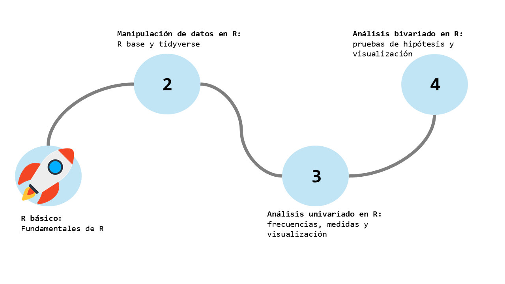
---
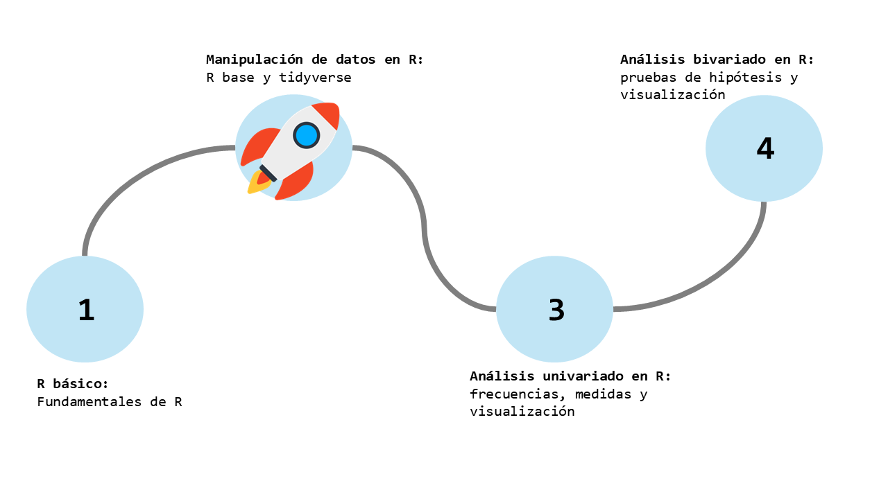
---

---
class: inverse, left, middle

# Contenidos de la sesión

--

**0. Recordando...**

--

**1. Funciones para el análisis univariado**

--

**2. Una intro a la visualización**

--

**3. Manos a la obra**

```{r include=FALSE}
pacman::p_load(tidyverse, sjmisc, sjlabelled)
```

---

class: middle, center, inverse

# _0. Recordando..._

---
# Recordando el flujo de trabajo

(1) Crear una carpeta dónde alojaremos todos los archivos relacionados a nuestro proyecto. Por ejemplo: `enssex`.

(2) A modo de recomendación, crear tres carpetas: `input`, `processing`y `output`. Dentro de `input` crear la carpeta `original` y `proc`.

(3) Alojar el set de datos que utilizaremos para nuestros análisis en la `input/original`.

(4) Abrir RStudio. Dirigir el cursor a la esquina superior derecha y hacer click en _Project: (None)_.

(5) En la ventana emergente, hacer click en _New project..._. Luego, hacer click en _Existing directory_. En la siguiente ventana, hacer click en _Browse_ y escoger la carpeta creada. Finalmente, hacer click en _**Create project**_.

---
# Recordando el flujo de trabajo

(6) En RStudio, estando en nuestro proyecto, abrir un nuevo script: ir a esquina superior izquierda y _File > New file > RScript_ o `Ctrl + Shift + n`. Guardar haciendo click en el icono de disquete o `Ctrl + s`. Recomendación, guardar en carpeta `processing` con un nombre que haga alusión al procesamiento de datos.

(7) En nuestro script, partir con información de identificación del script: título, nombre de quien lo realiza, fecha, institución, resumen de que hace. Recomendación, separar el código por secciones. Usar `Ctrl + Shift + R`.

(8) Luego, seguir con una sección dónde se instalen los paquetes (si es necesario) y se carguen. Recomendación, utilizar `pacman::p_load()`.

(9) Luego, seguir con una sección dónde se realice el procesamiento de datos necesario.

(10) Por último, terminar con una sección dónde se guarde el dataset procesado. Recomendación, guardar en `input/proc`.

---
class: middle, center

# Recordemos cómo leer R...
---

.center[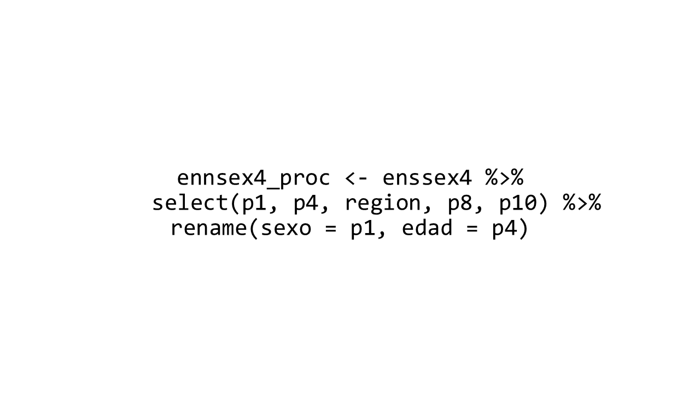]

R, quiero que...

---

.center[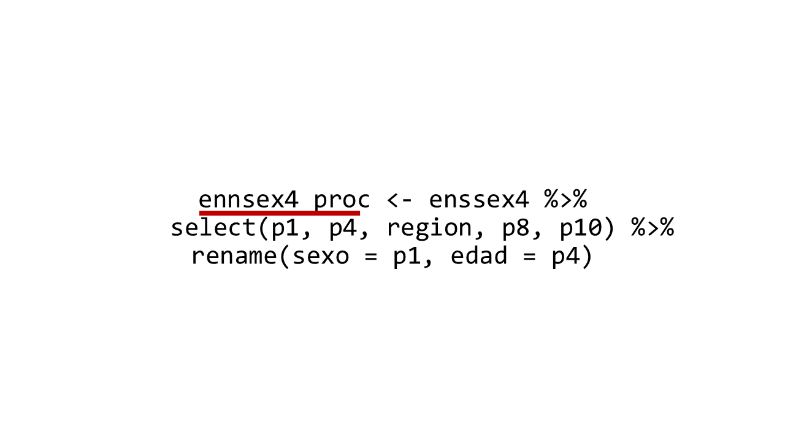]

R, quiero que **<span style="color:#c40404">crees un objeto llamado enssex4_proc</span>**...

---

.center[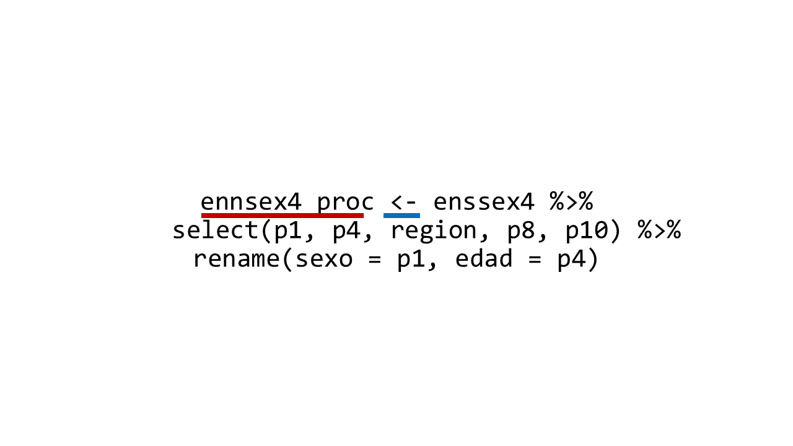]

R, quiero que **<span style="color:#c40404">crees un objeto llamado enssex4_proc</span>**  **<span style="color:#0772c2">al cual asignale el siguiente procedimiento:</span>**...

---

.center[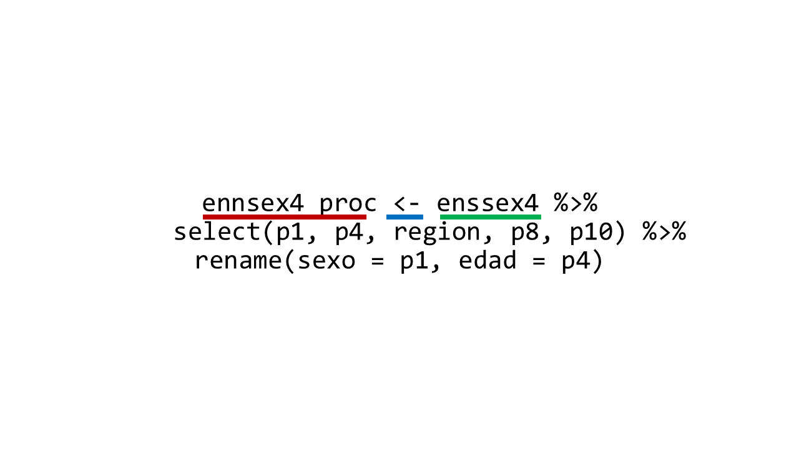]

R, quiero que **<span style="color:#c40404">crees un objeto llamado enssex4_proc</span>**  **<span style="color:#0772c2">al cual asignale el siguiente procedimiento:</span>** **<span style="color:#54ad7d"> accede al data.frame enssex4</span>**...

---
.center[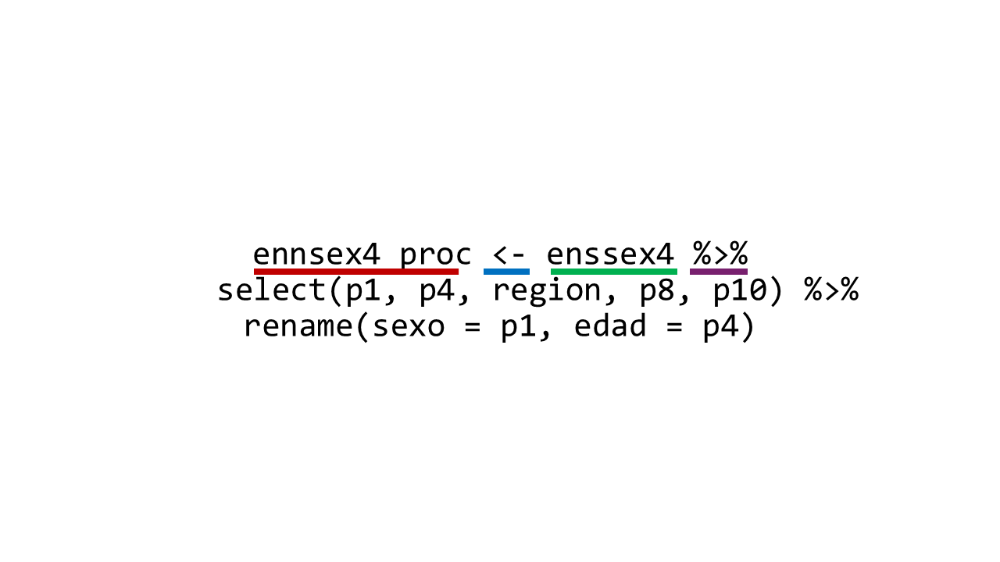]

R, quiero que **<span style="color:#c40404">crees un objeto llamado enssex4_proc</span>**  **<span style="color:#0772c2">al cual asignale el siguiente procedimiento:</span>** **<span style="color:#54ad7d">accede al data.frame enssex4</span>** **<span style="color:#773a6c">y luego </span>**...

---
.center[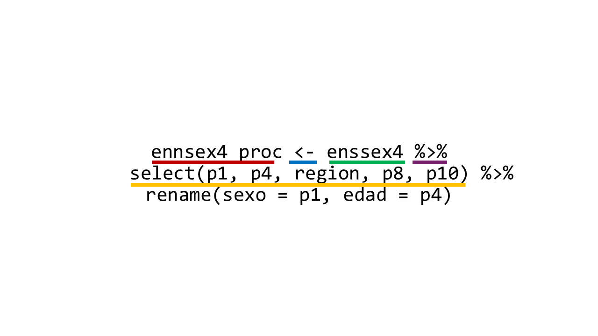]

R, quiero que **<span style="color:#c40404">crees un objeto llamado enssex4_proc</span>**  **<span style="color:#0772c2">al cual asignale el siguiente procedimiento:</span>** **<span style="color:#54ad7d">accede al data.frame enssex4</span>** **<span style="color:#773a6c">y luego </span>** **<span style="color:#f7c626">selecciona las columnas p1, p4, region, p8 y p10</span>**...
---
.center[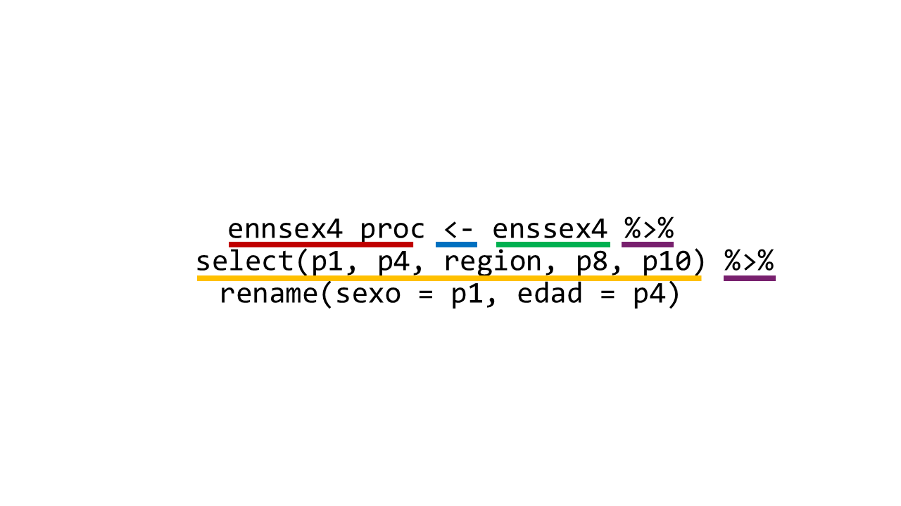]

R, quiero que **<span style="color:#c40404">crees un objeto llamado enssex4_proc</span>**  **<span style="color:#0772c2">al cual asignale el siguiente procedimiento:</span>** **<span style="color:#54ad7d">accede al data.frame enssex4</span>** **<span style="color:#773a6c">y luego </span>** **<span style="color:#f7c626">selecciona las columnas p1, p4, region, p8 y p10</span>** **<span style="color:#773a6c">y luego </span>**...
---
.center[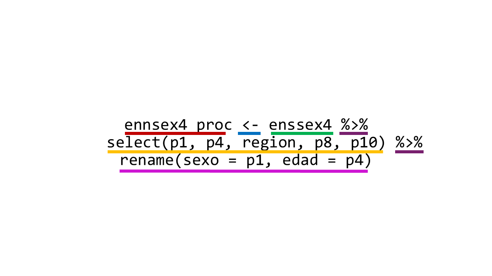]

R, quiero que **<span style="color:#c40404">crees un objeto llamado enssex4_proc</span>**  **<span style="color:#0772c2">al cual asignale el siguiente procedimiento:</span>** **<span style="color:#54ad7d">accede al data.frame enssex4</span>** **<span style="color:#773a6c">y luego </span>** **<span style="color:#f7c626">selecciona las columnas p1, p4, region, p8 y p10</span>** **<span style="color:#773a6c">y luego </span>** **<span style="color:#ce1cd5"> renombra la columna p1 por sexo y la columna p4 por edad</span>**.

---
# Glosario

| Concepto      | Definición                                                                 |
|---------------|----------------------------------------------------------------------------|
| Base de datos | Conjunto de tablas de datos interrelacionadas lógicamente.    |
| Dataset o tabla de datos      | Conjunto de datos, generalmente en forma tabular, usado para análisis.     |
| data.frame    | Tabla de datos en R; colección de columnas (vectores) del mismo largo.     |
| Variable      | Concepto más sustantivo. Característica o atributo medido sobre cada unidad de análisis; corresponde a una columna. |
| Columna       | Vector dentro de un `data.frame`; representa una variable.                |
| Vector        | Estructura básica que almacena datos del mismo tipo en una dimensión. Puede ser utilizado solo o dentro de un data.frame (columna)   |
| Fila          | Observación individual en un `data.frame`.                                |

---
# Glosario

| Concepto      | Definición                                                                 |
|---------------|----------------------------------------------------------------------------------|
| Objeto        | Cualquier entidad almacenada en R: puede ser un vector, función, dataframe, etc. |
| Asignador     | Operador que asigna valores a objetos. En R se usa `<-` o `=`.             |
| Operador      | Símbolo que realiza una operación. Ej.: `+`, `==`, `%in%`, &#124;, etc.       |
| Función       | Conjunto de instrucciones que realiza una tarea. Se llama con `()`.        |
| Paquete       | Colección de funciones, datos y documentación. Ej.: `dplyr`, `ggplot2`.    |

---
# Funciones esenciales de dplyr

| Función      | Descripción                                                                 |
|--------------|------------------------------------------------------------------------------|
| `select()`   | Selecciona columnas del dataframe. Permite elegir variables específicas.     |
| `rename()`   | Cambia el nombre de una o más columnas.                                      |
| `filter()`   | Filtra filas según condiciones lógicas.                                      |
| `case_when()`| Recodifica variables con condiciones múltiples. Alternativa elegante a `ifelse()`. |
| `mutate()`   | Crea nuevas columnas o modifica columnas existentes.                         |
| `group_by()` | Agrupa los datos por una o más variables para realizar resúmenes posteriores.|
| `summarise()`| Resume datos por grupos: medias, conteos, proporciones, etc.                 |
| `distinct()` | Devuelve solo las filas únicas según una o más columnas.                     |
| `arrange()`  | Ordena las filas por una o más variables (ascendente o descendente).         |
---
class: middle, center, inverse

# _1. Funciones para la visualización_

---
# ¿Qué es el análisis univariado? 🧐

--

.large[Se refiere al análisis de **una sola variable** a la vez.]

--

.large[Su objetivo es **describir** y resumir el comportamiento o la distribución de esa variable.]

--

.large[Es el **paso inicial** en el análisis de datos y permite armar un panorama de este.]

---
# ¿Y en el contexto de la investigación?

El análisis univariado cumple un rol fundamental en las primeras etapas de una investigación cuantitativa, ya que permite:

--

- 🧹 **Evaluar la calidad de los datos: ** detectar errores o inconsistencias (ej. valores extremos o codificaciones incorrectas) o revisar supuestos (ej. normalidad).

--

- 🔍 **Caracterizar la muestra: ** entregar una descripción del perfil de los encuestados. P.ej ver la composición sociodemográfica: edad, género, nivel educativo, etc.

--

- 🧭 **Tomar decisiones analíticas informadas:** Se justifica categorizar una variable? ¿Cuál es la mejor forma de agrupar respuestas? ¿Qué medidas de tendencia central y dispersión tienen sentido?

--

- 🗺️** Contextualizar hallazgos posteriores:** ayuda a interpretar resultados más complejos (ej. bi o multivariados) entendiendo primero la distribución simple de cada variable.

---
# ¿Y qué herramientas tenemos?

--

.large[Las 💫**funciones**💫, pero...]

---
# ¿Y qué herramientas tenemos?

.large[Las 💫**funciones**💫, pero... hay muchas funciones]

--

.large[Las funciones que utilizaremos dependerán de...]

--

- .large[Los tipos de variables que tengamos]

--

- .large[Lo que queramos hacer]

---
# Tipos de variables

--

## 🔡Categóricas

--

- **Nominales:** no tienen orden (ej. sexo, país).

--

- **Ordinales:** tienen orden (ej. nivel educacional, satisfacción).

--

## 🔢Cuantitativas

--

- **Discretas:** toman valores enteros (ej. número de hijos).

--

- **Continuas:** pueden tomar cualquier valor en un rango (ej. ingreso, altura).

---
# ¿Y qué queremos/podemos hacer?

.large[Dependiendo del tipo de variables que tengamos, podemos analizar distrubuciones, frecuencias, medidas de tendencia central, medidas de dispersión y medidas de posición.]

--

.large[Veamos...]

---
# Retomemos los datos de ejemplo...

```{r}
datos <- data.frame(
  persona = c("Juan", "Matias", "Ana", "Leonor", "Sebastian"),
  edad = c(24, 35, 45, 65, 12),
  sexo = c("Hombre", "Hombre", "Mujer", "Mujer", "Hombre"),
  ingresos = c(1000000, 800000, 1300000, 1500000, 0),
  region = c("Metropolitana", "Metropolitana", "Valparaiso", "Valparaiso", "Antofagasta")
)
```

---
# Frecuencias

| Función             | Descripción                                     | Tipo de variable     |
|---------------------|-------------------------------------------------|-----------------------|
| `table()`           | Crea una tabla de frecuencias absolutas         | Categórica            |
| `prop.table()`      | Devuelve proporciones a partir de `table()`     | Categórica            |
| `count()` (dplyr)   | Cuenta frecuencias por categoría                 | Categórica            |

---
# Frecuencias

--

```{r}
tabla_region <- table(datos$region)
tabla_region
```

--

```{r}
prop.table(tabla_region)
```
---
# Frecuencias
## Con dplyr 🔧

--

```{r}
datos %>% count(region) # Versión simplificada
```

--

```{r}
datos %>% group_by(region) %>% summarise(n = n()) # Versión larga
```

---
# Frecuencias
## Un buen amigo... `sjmisc`

--

El paquete `sjmisc` es parte de un conjunto de paquetes con herramientas útiles para el trabajo con datos en ciencias sociales (sus hermanos: `sjPlot` y `sjlabelled`).

--

Una función muy útil de este paquete es `frq()`

--

`frq()` nos muestra las frecuencias absolutas, porcentuales _brutas_ y porcentuales válidas.

---
# Frecuencias
## Un buen amigo... `sjmisc`

```{r}
sjmisc::frq(datos$region)
```

---
# Frecuencias
## Un buen amigo... `sjmisc`

--

Por ejemplo, si tuvieramos `NA`

--

```{r}
datos$region[5] <- NA # Asignamos un NA a la fila 5
```

--

Y luego vemos las frecuencias...

---
# Frecuencias
## Un buen amigo... `sjmisc`

```{r}
sjmisc::frq(datos$region)
```

--

**Raw %:** Considera `NA` como una categoría y esta representa el 20%.

**Valid %:** No considera `NA` como categoría, por ende el porcentaje se redistribuye en las otras categorías.

---
# Frecuencias
## Un buen amigo... `sjmisc`

--

.large[Una de las principales virtudes de `frq()` es que permite presentar una tabla de frecuencias considerando las 💫**etiquetas**💫, pero...]

--

.large[¿Qué son las etiquetas?]

---
# 🏷️Etiquetas en R: ¿Qué son y para qué sirven?

--

Las etiquetas (labels) permiten asociar descripciones legibles a variables y a sus valores.

--

Son útiles para:

--

- Mejorar la interpretación de resultados.

--

- Facilitar la presentación de datos (en tablas o gráficos).

--

- Documentar datasets complejos, como encuestas.

---
# 🏷️Etiquetas en R: ¿Qué son y para qué sirven?
## El paquete `sjlabelled`

--

Un paquete del ecosistema `sj` diseñado para ver, asignar, modificar y eliminar etiquetas (_labels_) de variables y de sus valores.


---
# Funciones de `sjlabelled`

| Función               | Descripción                                      |
| --------------------- | ------------------------------------------------ |
| `get_label()`         | Ver la etiqueta de una variable                  |
| `set_label()`         | Asignar una etiqueta a una variable              |
| `get_labels()`        | Ver etiquetas de valores (value labels)          |
| `set_labels()`        | Asignar etiquetas de valores                     |
| `remove_labels()`     | Eliminar etiquetas de valores                    |
| `remove_all_labels()` | Eliminar todas las etiquetas (incluye var label) |
| `to_factor()`         | Convertir variables etiquetadas a factores       |

---
# Etiquetas: un ejemplo

Creemos un dataset similar al anterior, pero con una diferencia...

```{r}
datos2 <- data.frame(
  persona = c("Juan", "Matias", "Ana", "Leonor", "Sebastian"),
  edad = c(24, 35, 45, 65, 12),
  sexo = c(1, 1, 2, 2, 1),
  ingresos = c(1000000, 800000, 1300000, 1500000, 0),
  region = c(7, 7, 6, 6, 3)
)
```

Las variables de `sexo` y `region` ahora son tipo `numeric`, en vez de `character`.

---
# Etiqutas: un ejemplo

En estos casos, las etiquetas serán fundamentales para tener información sustantiva de a qué refieren las variables y sus categorías.

Creemos etiquetas para la variable...

```{r}
datos2 <- datos2 %>% mutate(
  persona = set_label(persona, "Nombre del informante"),
  edad = set_label(edad, "Edad del informante"),
  sexo = set_label(sexo, "Sexo del informante"),
  ingresos = set_label(ingresos, "Ingresos del informante"),
  region = set_label(region, "Region de residencia del informante")
)
```

---
# Etiquetas: un ejemplo

Pasamos de un dataset sin etiquetas en las variables...


.center[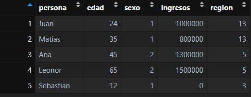]

---
# Etiquetas: un ejemplo

A un dataset con etiquetas en las variables...

.center[]

---
# Etiquetas: un ejemplo

Asi como podemos etiquetar las variables, también podemos etiquetas los valores/categorías:

```{r}
datos3 <- datos2 %>% mutate(
  sexo = set_labels(sexo, labels = c(
    "Hombre" = 1, "Mujer" = 2)
    ),
  region = set_labels(region, labels = c(
    "Arica" = 1, "Tarapaca" = 2, "Antofagasta" = 3, 
    "Atacama" = 4, "Coquimbo" = 5, "Valparaiso" = 6, 
    "Metropolitana" = 7, "O'Higgins" = 8, "Maule" = 9, 
    "Nuble" = 10, "Biobio" = 11, "Araucania" = 12, 
    "Los Rios" = 13, "Los Lagos" = 14, "Aysen" = 15, 
    "Magallanes" = 16)
    )
  )
```

---
# Etiquetas: un ejemplo

Pasamos de tener un dataset sin etiquetas en las categorías...

```{r}
frq(datos2$sexo)
```

---
# Etiquetas: un ejemplo
 
A uno con etiquetas en las categorías...

```{r}
frq(datos3$sexo)
```
---

⚠️**IMPORTANTE:** Al etiquetar categorías que no existen empiricamente, `frq()` las considera como una categoría con frecuencia 0

```{r}
frq(datos3$region)

```
---
class: middle, center

# Volvamos...

---

class: middle, center, inverse

# _¡Muchas gracias!_