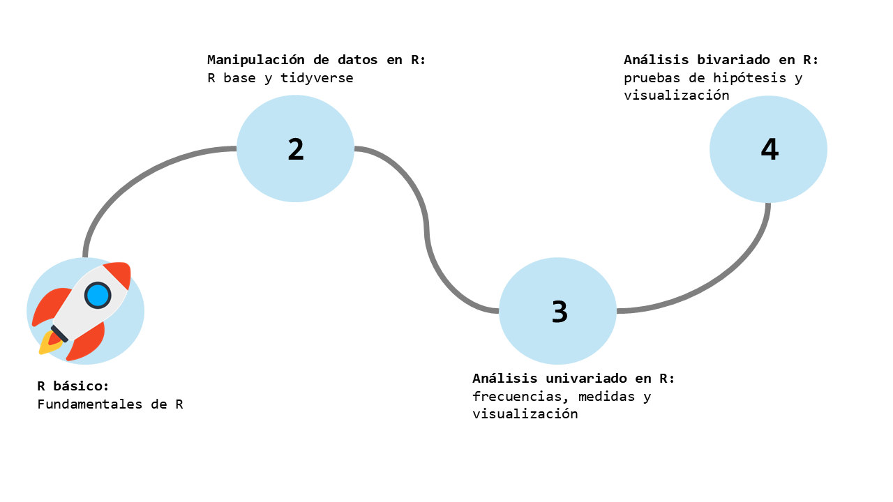
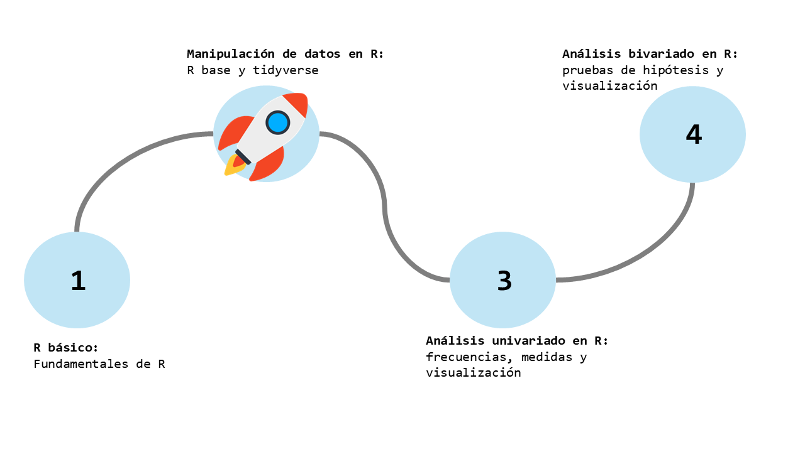
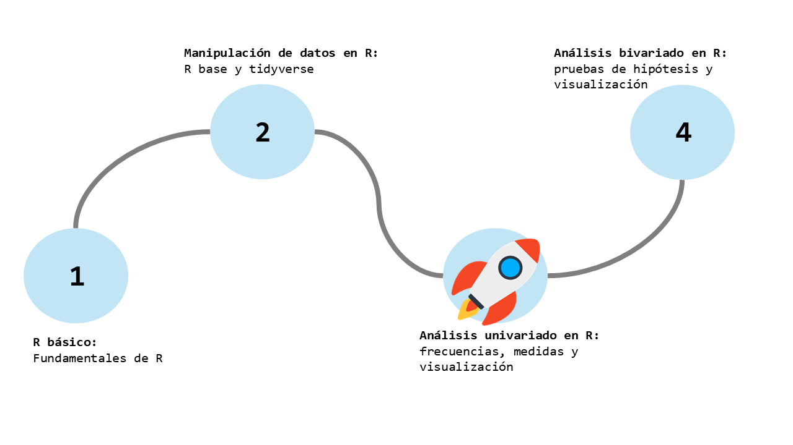
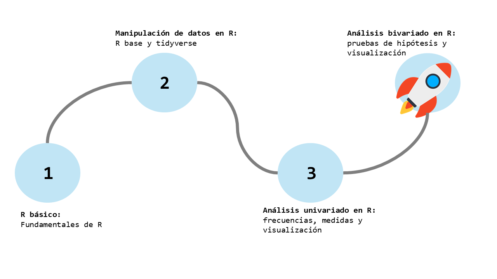

layout: true
class: animated, fadeIn

---
class: inverse, left, middle

# _Analizando bivariadamente en R 🔎X↔️Y_


Martín Venegas Márquez


***
[Doctorado en Psicología UDP - Seminario Metodológico Disciplinario: Metodologías Cuantitativas - Otoño 2025]()

<br>

#### Junio, 2025

---

---

---

---

---
class: inverse, left, middle

# Contenidos de la sesión

--

**0. Recordando...**

--

**1. Análisis bivariado descriptivo**

--

**2. Análisis bivariado inferencial**

--

**3. Manos a la obra**

```{r include=FALSE}
pacman::p_load(tidyverse, sjmisc, sjlabelled, statip, sjPlot)
```

---

class: middle, center, inverse

# _0. Recordando..._

---
# Frecuencias
---
class: middle, center

# Medidas de tendnecia central


---
| Tipo de medida          | Función en R             | Descripción breve                                                           |
|-------------------------|--------------------------|------------------------------------------------------------------------------|
| Tendencia central       | `mean(x)`                | Calcula la media (promedio) de `x`.                                         |
| Tendencia central       | `mean(x, trim = 0.1)`    | Media recortada: excluye un porcentaje de valores extremos.                |
| Tendencia central       | `median(x)`              | Devuelve la mediana de `x` (valor central).                                 |
| Tendencia central       | `statip::mfv(x)`         | Calcula la moda (valor o valores más frecuentes).                           |
| Dispersión              | `var(x)`                 | Calcula la varianza de `x`.                                                 |
| Dispersión              | `sd(x)`                  | Desviación estándar: raíz cuadrada de la varianza.                          |
| Dispersión              | `range(x)`               | Devuelve el valor mínimo y máximo de `x`.                                   |
| Dispersión              | `IQR(x)`                 | Rango intercuartílico: diferencia entre el tercer y primer cuartil (Q3 - Q1). |
| Posición / Cuantiles    | `quantile(x)`            | Entrega los cuantiles de `x` (por defecto: 0%, 25%, 50%, 75%, 100%).         |

---

| Tipo de gráfico       | Uso principal                                           | Argumentos clave en `plot_frq()`           |
|-----------------------|---------------------------------------------------------|---------------------------------------------|
| Gráfico de barras     | Visualizar frecuencias absolutas o relativas de factores| `type = "bar"` (valor por defecto)          |
| Histograma            | Distribución de variables numéricas                     | `type = "hist"`                              |
| Gráfico de densidad   | Distribución suavizada de variables numéricas           | `type = "dens"`                              |
| Boxplot (cajas)       | Visualizar la mediana, cuartiles y valores atípicos     | `type = "box"`                               |

---

# ¿Qué es el análisis bivariado? 🤓

--

- Es el estudio simultáneo de **dos variables** para comprender su relación.

---

- Permite:
  - Detectar patrones 📈
  - Formular o contrastar hipótesis 💡
  - Preparar el camino para modelos más complejos 🗺

---

# Importancia en la investigación social 🔎

--

- Las relaciones entre variables son el corazón de las preguntas sociales:
  - ¿Afecta el nivel educativo la participación política?
  - ¿Hay desigualdad de ingresos según género?
  - ¿Existe una relación entre edad y actitudes hacia políticas públicas?

--

- El análisis bivariado nos ayuda a:
  - Identificar **asociaciones relevantes**.
  - Evaluar **desigualdades** y **brechas**.
  - Formular **modelos explicativos**.

---

# Tipos de relaciones a explorar

--

- 🧱 Categórica + Categórica: Asociación

--

- 📏 Categórica + Continua: Comparación de medias

--

- 📈 Continua + Continua: Correlación

---

class: middle, center, inverse

# _1. Análisis bivariado descriptivo_

---

## 1. Dos variables categóricas 🧱

- `table()`, `count()`, `janitor::tabyl()`
- Proporciones:
  - conjuntas
  - marginales
  - condicionales
- Gráficos:
  - Barras apiladas (`position = "stack"`)
  - Barras lado a lado (`position = "dodge"`)

---

## 2. Categórica + Continua 📏

- Promedios por grupo:  
  `datos %>% group_by(grupo) %>% summarise(media = mean(variable))`

- Visualizaciones:
  - `ggplot2::geom_boxplot()`
  - `ggplot2::geom_violin()` (opcional)

---

## 3. Dos variables continuas

- Correlación: `cor(x, y)`
- Diagrama de dispersión:  
  `ggplot(datos, aes(x, y)) + geom_point()`
- Recta de regresión:  
  `+ geom_smooth(method = "lm")`

---

# 🔬 Análisis bivariado inferencial

---

## 1. Categórica + Categórica

- Prueba de Chi-cuadrado: `chisq.test()`
- Requisitos:
  - Tamaño de muestra
  - Frecuencias esperadas

---

## 2. Categórica + Continua

- Dos grupos: `t.test(continua ~ grupo)`
- Más de dos grupos:  
  `modelo <- aov(continua ~ grupo, data = datos)`

---

## 3. Dos continuas

- `cor.test(x, y)`
- Pearson por defecto
- Spearman para datos no normales u ordinales

---

# 🛠 Ejercicio práctico

- Usar una base de datos conocida
- Aplicar cada tipo de análisis
- Interpretar resultados

---

# 📌 Cierre

- El análisis bivariado:
  - Profundiza la comprensión de los datos.
  - Da soporte empírico a nuestras preguntas de investigación.
  - Prepara el camino para análisis multivariados.


---
class: middle, center, inverse

# _¡Muchas gracias!_