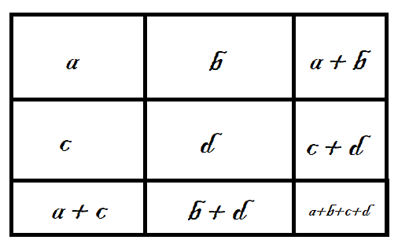

layout: true
class: animated, fadeIn

---
class: inverse, left, middle

# _Analizando bivariadamente en R 🔎X↔️Y_


Martín Venegas Márquez


***
[Doctorado en Psicología UDP - Seminario Metodológico Disciplinario: Metodologías Cuantitativas - Otoño 2025]()

<br>

#### Junio, 2025

---

---

---

---

---
class: inverse, left, middle

# Contenidos de la sesión

--

**0. Recordando...**

--

**1. Análisis bivariado descriptivo**

--

**2. Análisis bivariado inferencial**

--

**3. Manos a la obra**

```{r include=FALSE}
pacman::p_load(tidyverse, sjmisc, sjlabelled, statip, sjPlot)
```

---

class: middle, center, inverse

# _0. Recordando..._

---
# Frecuencias
---
class: middle, center

# Medidas de tendencia central


---
| Tipo de medida          | Función en R             | Descripción breve                                                           |
|-------------------------|--------------------------|------------------------------------------------------------------------------|
| Tendencia central       | `mean(x)`                | Calcula la media (promedio) de `x`.                                         |
| Tendencia central       | `mean(x, trim = 0.1)`    | Media recortada: excluye un porcentaje de valores extremos.                |
| Tendencia central       | `median(x)`              | Devuelve la mediana de `x` (valor central).                                 |
| Tendencia central       | `statip::mfv(x)`         | Calcula la moda (valor o valores más frecuentes).                           |
| Dispersión              | `var(x)`                 | Calcula la varianza de `x`.                                                 |
| Dispersión              | `sd(x)`                  | Desviación estándar: raíz cuadrada de la varianza.                          |
| Dispersión              | `range(x)`               | Devuelve el valor mínimo y máximo de `x`.                                   |
| Dispersión              | `IQR(x)`                 | Rango intercuartílico: diferencia entre el tercer y primer cuartil (Q3 - Q1). |
| Posición / Cuantiles    | `quantile(x)`            | Entrega los cuantiles de `x` (por defecto: 0%, 25%, 50%, 75%, 100%).         |

---

# Tipos de gráficos con `sjPlot`

| Tipo de gráfico       | Uso principal                                           | Argumentos clave en `plot_frq()`           |
|-----------------------|---------------------------------------------------------|---------------------------------------------|
| Gráfico de barras     | Visualizar frecuencias absolutas o relativas de factores| `type = "bar"` (valor por defecto)          |
| Histograma            | Distribución de variables numéricas                     | `type = "hist"`                              |
| Gráfico de densidad   | Distribución suavizada de variables numéricas           | `type = "dens"`                              |
| Boxplot (cajas)       | Visualizar la mediana, cuartiles y valores atípicos     | `type = "box"`                               |

---

# ¿Qué es el análisis bivariado? 🤓

--

.large[Es el estudio simultáneo de **dos variables** para comprender su relación]

--

.large[Permite:]

--

.large[(1) Detectar patrones 📈]

--

.large[(2) Formular o contrastar hipótesis 💡]

--

.large[(3) Preparar el camino para modelos más complejos 🚀]

---

# Importancia en la investigación social 🔎

--

.large[Las relaciones entre variables son el corazón de las preguntas en la investigación social:]

  - ¿Afecta el nivel educativo la participación política?
  - ¿Hay desigualdad de ingresos según género?
  - ¿Existe una relación entre edad y actitudes hacia políticas públicas?

--

.large[El análisis bivariado nos ayuda a:]

  - Identificar **asociaciones relevantes**.
  - Evaluar **desigualdades** y **brechas**.
  - Formular **modelos explicativos**.

---

# Tipos de relaciones a explorar

--

.large[📏 ** Categórica + Continua:** Comparación de estadísticos por cada categoría]

--

.large[🧱 **Categórica + Categórica:** Distribución conjunta de frecuencias]

--

.large[**📈 Continua + Continua:** Covarianzas y correlaciones]

---

class: middle, center, inverse

# _1. Análisis bivariado descriptivo_

---

# Retomemos los datos de ejemplo...

```{r}
datos <- data.frame(
  persona = c("Juan", "Matias", "Ana", "Leonor", "Sebastian"),
  edad = c(24, 35, 45, 65, 12),
  sexo = c("Hombre", "Hombre", "Mujer", "Mujer", "Hombre"),
  ingresos = c(1000000, 800000, 1300000, 1500000, 0),
  region = c("Metropolitana", "Metropolitana", "Valparaiso", "Valparaiso", "Antofagasta")
)
```
---

# 1. Categórica + Continua 📏

--

Implica analizar los estadísticos de interés (media, mediana, desviación estándar, etc) de una variable cuantitativa en base a las categorías de una variable categórica

--

Por ejemplo:

--

```{r}
datos %>% group_by(sexo) %>% summarise(media = mean(edad))
```

---

# 1. Categórica + Continua 📏

--

Con `dplyr` podemos crear una columna por cada estadístico de interés:

--

```{r}
datos %>% 
  group_by(sexo) %>% 
  summarise(
    n = n(),
    min = min(edad),
    max = max(edad),
    media = mean(edad),
    mediana = median(edad),
    DE = sd(edad)
    )
```

---
# 1. Categórica + Continua 📏

--

Una visualización común:

--

Boxplots por grupo...

--

```r
# Generemos datos aleatorios para la visualización

set.seed(1) 

datos2 <- data.frame(
  edad = sample(18:98, 10000, replace = T),
  sexo = sample(c("Hombre", "Mujer"), 10000, replace = T)
)

# Generar boxplot
sjPlot::plot_grpfrq(datos2$edad, datos2$sexo, type = "boxplot")
```

---
# 1. Categórica + Continua 📏

```{r echo = FALSE, eval = TRUE, warning = FALSE}
# Generemos datos aleatorios para la visualización

set.seed(1)

datos2 <- data.frame(
  edad = sample(18:98, 10000, replace = T),
  sexo = sample(c("Hombre", "Mujer"), 10000, replace = T)
)

sjPlot::plot_grpfrq(datos2$edad, datos2$sexo, type = "boxplot")
```

---
# 2. Categórica + Categórica 🧱

--

Se analiza la distribución conjunta de dos variables categóricas. Esto implica ver las frecuencias (porcentuales y absolutas) por cada combinación de categorías.

--

**La presentación más común:** tablas de contingencia/tablas de doble entrada

--

.center[]
---

# 2. Categórica + Categórica 🧱

## Un amigo... `janitor::tabyl()`


```r

# Cargar paquete
library(janitor)

# Crear datos aleatorios
set.seed(1)

datos3 <- data.frame(
  educ = sample(c("Sin educación formal", "Primaria completa", "Secundaria incompleta", "Terciaria y postitulo"), 10000, replace = T),
  sexo = sample(c("Hombre", "Mujer"), 10000, replace = T)
)

# Generar tabla
datos3 %>% 
  tabyl(sexo, educ) %>% %>% # Función que hace la pega!
  adorn_percentages("row") %>% # Calcular porcentajes por fila
  adorn_pct_formatting(digits = 2) %>% # Formatear porcentajes
  adorn_ns() # Agregar n's
```

---
# 2. Categórica + Categórica 🧱
## Un amigo... `janitor::tabyl()`

--

Veamos los porcentajes por **fila**...

--

```{r eval=TRUE, echo=FALSE, message=FALSE, warning=FALSE}

# Cargar paquete
library(janitor)

# Crear datos aleatorios
set.seed(1)

datos3 <- data.frame(
  educ = sample(c("Sin educación formal", "Primaria completa", "Secundaria incompleta", "Terciaria y postitulo"), 10000, replace = T),
  sexo = sample(c("Hombre", "Mujer"), 10000, replace = T)
)

# Generar tabla
datos3 %>% 
  tabyl(sexo, educ) %>% # Función que hace la pega!
  adorn_percentages("row") %>% # Calcular porcentajes por fila
  adorn_pct_formatting(digits = 2) %>% # Formatear porcentajes
  adorn_ns() # Agregar n's
```

--

Y los porcentajes por **columnas**

--

```{r eval=TRUE, echo=FALSE, message=FALSE, warning=FALSE}
# Generar tabla
datos3 %>% 
  tabyl(sexo, educ) %>% # Función que hace la pega!
  adorn_percentages("col") %>% # Calcular porcentajes por fila
  adorn_pct_formatting(digits = 2) %>% # Formatear porcentajes
  adorn_ns() # Agregar n's
```

---
## Otro amigo... `sjPlot::sjt.xtab()`

```{r results='asis'}
sjPlot::sjt.xtab(datos3$sexo, datos3$educ) # Solo n
```

---
## Otro amigo... `sjPlot::sjt.xtab()`

```{r results='asis'}
sjPlot::sjt.xtab(datos3$sexo, datos3$educ, show.cell.prc = TRUE) # Porcentaje por filas
```

---
## Otro amigo... `sjPlot::sjt.xtab()`

```{r results='asis'}
sjPlot::sjt.xtab(datos3$sexo, datos3$educ, show.col.prc = TRUE) # Porcentaje por filas
```

---
## Otro amigo... `sjPlot::sjt.xtab()`

```{r results='asis'}
sjPlot::sjt.xtab(datos3$sexo, datos3$educ, show.cell.prc = TRUE, show.col.prc = TRUE) # Ambos porcentjaes
```
---

# 3. 📈 Continua + Continua:
## 🔗 Correlación de Pearson

--

.large[Es una medida que cuantifica la **fuerza y dirección** de la relación lineal entre dos variables numéricas]

--

.large[También se conoce como **coeficiente de correlación de Pearson** o simplemente **r**.]

---
## 🔗 Correlación de Pearson
### 🧮 Definición matemática

--

La covarianza dividida por el producto de las desviaciones estándar de cada variable

--

$$
r = \frac{\sum (X_i - \bar{X})(Y_i - \bar{Y})}
         {\sqrt{\sum (X_i - \bar{X})^2} \cdot \sqrt{\sum (Y_i - \bar{Y})^2}}
$$

--

También puede expresarse como:

--

$$
r = \frac{\text{Cov}(X, Y)}{\sigma_X \cdot \sigma_Y}
$$

---
## 🔗 Correlación de Pearson
### 📈 Interpretación

--

- **r = 1**: correlación perfectamente positiva  
- **r = -1**: correlación perfectamente negativa  
- **r = 0**: no hay relación lineal

---
## 🔗 Correlación de Pearson
### 💻 En R

--

```r
cor(x, y)
```

--

Veamos un ejemplo

--

```{r}
cor(datos$edad, datos$ingresos)
```
---
## 🔗 Correlación de Pearson
### ¿Cómo se interpreta? 🤓

--

Según Cohen...

--

- tamaño de efecto **pequeño**: alrededor de **0.10**

- tamaño de efecto **mediano**: alrededor de **0.30**

- tamaño de efecto **grande**: alrededor de **0.50 y más**


---
# 3. 📈 Continua + Continua:
## Gráficos de dispersión (_scatter plot_)

--

Creemos unos datos de ejemplo...

```{r}
set.seed(123)

datos4 <- data.frame(
  edad = sample(18:99, 1000, replace = TRUE)
)

# Relación moderada: ingresos dependen parcialmente de la edad + ruido
datos4$ingresos <- datos4$edad * 30000 + rnorm(1000, mean = 0, sd = 300000)

# Asegurarse de que los ingresos sean positivos
datos4$ingresos <- ifelse(datos4$ingresos < 0, 0, datos4$ingresos)

```

---
## Gráficos de dispersión (_scatter plot_)

```{r include=FALSE}
options(scipen = 999)
```


.pull-left[
```{r echo = FALSE, eval = TRUE, warning=FALSE}
sjPlot::plot_scatter(datos4, edad, ingresos)
```
]

.pull-right[.large[**¿Qué se puede interpretar de acá? 🧐**]]

--

.pull-right[

```{r}
cor(datos4$edad, datos4$ingresos)
```

]

---
class: middle, center, inverse

# _2. Análisis bivariado inferencial_

---
# 1. Categórica + Continua 📏
## Prueba t 🎉

--

.large[La prueba más común para este tipo de combinación de variables]

--

.large[Permite conocer si las **diferencias entre las medias de dos grupos distintos** son estadísticamente significativas]

--

.large[Por ejemplo:]

--

$H_0:$ No existen diferencias entre los ingresos medios de hombres y mujeres

$H_1:$ Existen diferencias entre los ingresos medios de hombres y mujeres

---
# 1. Categórica + Continua 📏
## Prueba t 🎉

--

.large[También, si los antecedentes o la teoría lo permite, se pueden contrastar hipótesis **direccionales**. Es decir...]

--

### Mayor a...

$H_0:$ Los ingresos medios de los hombres son menores o iguales a los de las mujeres

$H_1:$ Los ingresos medios de los hombres son mayores a los de las mujeress

---
# 1. Categórica + Continua 📏
## Prueba t 🎉

.large[También, si los antecedentes o la teoría lo permite, se pueden contrastar hipótesis **direccionales**. Es decir...]

--

### Menor a...

$H_0:$ Los ingresos medios de los hombres son mayores o iguales a los de las mujeres

$H_1:$ Los ingresos medios de los hombres son menores a los de las mujeres

---
## Prueba t 🎉
### En R 💻

--

Creemos otros datos de ejemplo...

```{r}

set.seed(1)

datos6 <- data.frame(
  sexo = rep(c("Hombre", "Mujer"), each = 50),
  ingresos = c(rnorm(50, mean = 1800000, sd = 200000),  # Hombres con media más alta
               rnorm(50, mean = 1500000, sd = 200000)))  # Mujeres con media más baja
```

---
## Prueba t 🎉
### En R 💻

--

```{r}
t.test(ingresos ~ sexo, data = datos6) # No direccional
```

--

.large[¿Qué podemos decir de este resultado? 🧐]

---
## Prueba t 🎉
### En R 💻

--

```{r}
t.test(ingresos ~ sexo, data = datos6, alternative = "greater") # Direccional: mayor a
```

--

.large[¿Qué podemos decir de estos resultados? 🧐]

---

## Prueba t 🎉
### En R 💻

--

```{r}
t.test(ingresos ~ sexo, data = datos6, alternative = "less") # Direccional: menor a
```

--

.large[¿Qué podemos decir de estos resultados? 🧐]

---
# 2. Categórica + Categórica 🧱
## Test de Chi-cuadrado

--

.large[Es una **prueba estadística** usada para analizar si existe una relación significativa entre dos variables categóricas]

--

.large[Compara las frecuencias observadas con las esperadas bajo la **hipótesis de independencia**]

--

$H_0$: La variable X e Y son independientes entre si

$H_1$: La variable X e Y no son independientes entre si

---
## Test de Chi-cuadrado
### Cálcular 🧮

--

Se basa en la fórmula:

--

$$
\chi^2 = \sum \frac{(O - E)^2}{E}
$$

--

Donde:

--

- \( O \): frecuencia observada
- \( E \): frecuencia esperada bajo la hipótesis de independencia

---
## Test de Chi-cuadrado
### Ejemplo 😎

--

Pensemos en un set de datos que contiene dos variables: sexo y preferencia por bebida caliente.

--
.pull-left[
.center[Tabla 1. Frecuencias observadas]

|         | Café | Té | Total |
|---------|------|----|-------|
| Hombre  | 30   | 10 | 40    |
| Mujer   | 20   | 40 | 60    |
| Total   | 50   | 50 | 100   |
]
--
.pull-right[
Queremos saber si hay asociación entre género y preferencia de bebida. 🧐

Es decir...

$H_0$: El sexo y la preferencia por bebida caliente son independientes entre si

$H_1$: El sexo y la preferencia por bebida caliente **no** son independientes entre si

]

---
## Test de Chi-cuadrado: paso a paso 🧮

(1) ** Calcular frecuencias esperadas**:

.pull-left[

.center[Tabla 1. Frecuencias observadas]

|         | Café | Té | Total |
|---------|------|----|-------|
| Hombre  | 30   | 10 | **40**    |
| Mujer   | 20   | 40 | 60    |
| Total   | **50**   | 50 | 100   |

]

.pull-right[


$$
E_{ij} = \frac{(fila_i) \cdot (columna_j)}{\text{Total}}
$$

Ejemplo para Hombre-Café:

$$
E_{Hombre-Café} = \frac{40 \cdot 50}{100} = 20
$$
]
---
## Test de Chi-cuadrado: paso a paso 🧮

(1) **Calcular frecuencias esperadas**:

.pull-left[

.center[Tabla 1. Frecuencias observadas]

|         | Café | Té | Total |
|---------|------|----|-------|
| Hombre  | 30   | 10 | 40    |
| Mujer   | 20   | 40 | 60    |
| Total   | 50   | 50 | 100   |

]

.pull-right[

.center[Tabla 2. Frecuencias esperadas]

|         | Café | Té | Total |
|---------|------|----|-------|
| Hombre  | $\frac{40 \cdot 50}{100} = 20$   | $\frac{40 \cdot 50}{100} = 20$ | 40    |
| Mujer   | $\frac{60 \cdot 50}{100} = 30$   | $\frac{60 \cdot 50}{100} = 30$ | 60    |
| Total   | 50   | 50 | 100   |

]

---
## Test de Chi-cuadrado: paso a paso 🧮

(2) **Calcular Chi-cuadrado parcial (por celda)**

.pull-left[

.center[Tabla 1. Frecuencias observadas]

|         | Café | Té | Total |
|---------|------|----|-------|
| Hombre  | 30   | 10 | 40    |
| Mujer   | 20   | 40 | 60    |
| Total   | 50   | 50 | 100   |

]

.pull-right[

.center[Tabla 2. Frecuencias esperadas]

|         | Café | Té | Total |
|---------|------|----|-------|
| Hombre  | $\frac{40 \cdot 50}{100} = 20$   | $\frac{40 \cdot 50}{100} = 20$ | 40    |
| Mujer   | $\frac{60 \cdot 50}{100} = 30$   | $\frac{60 \cdot 50}{100} = 30$ | 60    |
| Total   | 50   | 50 | 100   |

]

$\chi^2_{ij} = \frac{(O - E)^2}{E}$

$\chi^2_{Hombre-Café} = \frac{(30 - 20)^2}{20} = \frac{100}{20} = 5$

Se repite para cada celda, luego se suman todos los valores.

---
## Test de Chi-cuadrado: paso a paso 🧮

(3) **Chi-cuadrado total**:

.pull-left[

.center[Tabla 1. Frecuencias observadas]

|         | Café | Té | Total |
|---------|------|----|-------|
| Hombre  | 30   | 10 | 40    |
| Mujer   | 20   | 40 | 60    |
| Total   | 50   | 50 | 100   |


.left[
Recordemos la formula:
$\chi^2 = \sum \frac{(O - E)^2}{E}$
]

]

.pull-right[

.center[Tabla 2. Frecuencias esperadas]

|         | Café | Té | Total |
|---------|------|----|-------|
| Hombre  | $\frac{40 \cdot 50}{100} = 20$   | $\frac{40 \cdot 50}{100} = 20$ | 40    |
| Mujer   | $\frac{60 \cdot 50}{100} = 30$   | $\frac{60 \cdot 50}{100} = 30$ | 60    |
| Total   | 50   | 50 | 100   |

.left[
Apliquemosla:

$\chi^2 = \frac{(30 - 20)^2}{20} + \frac{(10 - 20)^2}{20} + \frac{(20 - 30)^2}{30} + \frac{(40 - 30)^2}{30}$

$\chi^2 = 5 + 5 + 3.33 + 3.33 = 16.66$
]
]

---
## Test de Chi-cuadrado
### Cálculo en R 💻

```{r}
# Crear un dataframe simulado
datos5 <- data.frame(
  genero = c(rep("Hombre", 40), rep("Mujer", 60)),
  bebida = c(rep("Café", 30), rep("Té", 10), rep("Café", 20), rep("Té", 40))
)

chisq.test(datos5$genero, datos5$bebida, correct = FALSE)

```
¿Qué podemos concluir? 🧐

---
# 3. 📈 Continua + Continua:
## 🔗 Correlación de Pearson

--

.large[Anteriormente, vimos la funciónm para obtener la **magnitud** del coeficiente de correlación (`cor()`), pero...]

--

.large[¿Cómo conocemos su información relativa a la inferencia estadística? 🧐]

--

Con: `cor.test()`

---
# 3. 📈 Continua + Continua:
## 🔗 Correlación de Pearson

--

```{r}
cor.test(datos4$edad, datos4$ingresos)
```

--

.large[¿Qué podemos decir de este resultado? 🧐]

--

.large[¿Qué hipótesis pusimos a prueba? 🔎]

---
class: middle, center, inverse

# _¡Muchas gracias!_